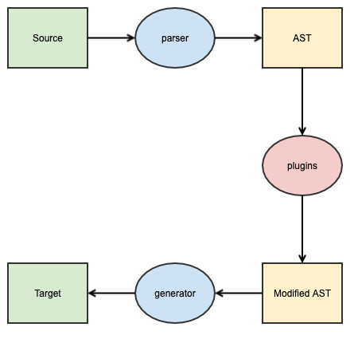
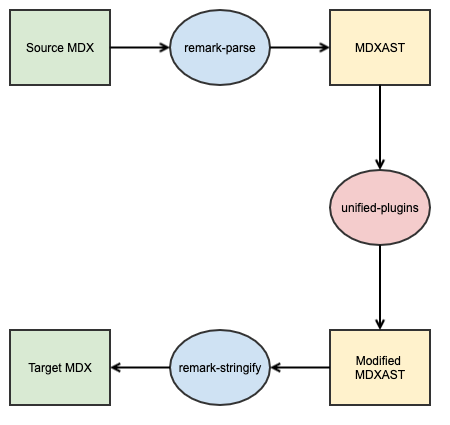

autoscale: true
build-lists: true
theme: Courier, 4

# [docz](https://www.docz.site) document to [Storybook](https://storybook.js.org) document - By MDXAST

---

# Translation

* Chinese > Spanish
* Chinese > Mexican

---

# Economics solution

* Chinese > English > Spanish
* Chinese > English > Mexican

---

# Abstract Syntax Tree

---

# Babel AST

```javascript
(foo, bar) => foo + bar;
```

---

```json
{
    "program": {
        "body": [
            {
                "type": "ExpressionStatement",
                "expression": {
                    "type": "ArrowFunctionExpression",
                    "params": [
                        {
                            "type": "Identifier",
                            "name": "foo"
                        },
                        {
                            "type": "Identifier",
                            "name": "bar"
                        }
                    ],
                    "body": {
                        "type": "BinaryExpression",
                        "left": {
                            "type": "Identifier",
                            "name": "foo"
                        },
                        "operator": "+",
                        "right": {
                            "type": "Identifier",
                            "name": "bar"
                        }
                    }
                }
            }
        ]
    }
}
```

---

# Transpilation



---

# The problem

* One document can be used by both docz and Storybook.

---

# [MDX](https://mdxjs.com)

---

# Tools

* [unified](https://unifiedjs.com) - Text transpile process interface
* [remark](https://remark.js.org) - MDX parser and generator
* remark plugins

---

# Process


