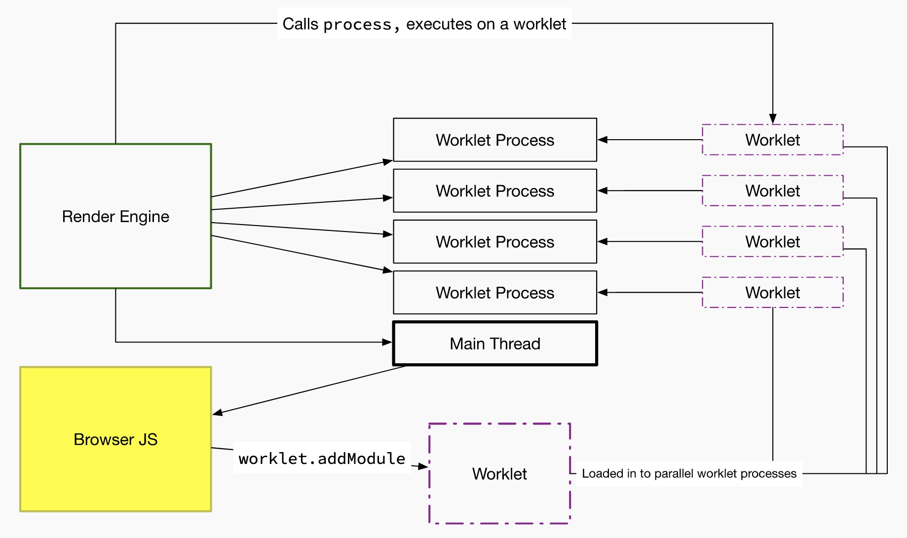

theme: Franziska, 9

# CSS Houdini

---

# Extend CSS via JavaScript

* low-level API
* direct access the CSSOM
* parsed as CSS
* faster than `HTMLElement.style`

---

# Features

* Worklets
* Typed OM
* Custom properties
* Paint API
* Animation API
* Layout API

---

# Worklets

---

# Reference

* [CSS HOUDINI](https://houdini.glitch.me/)
