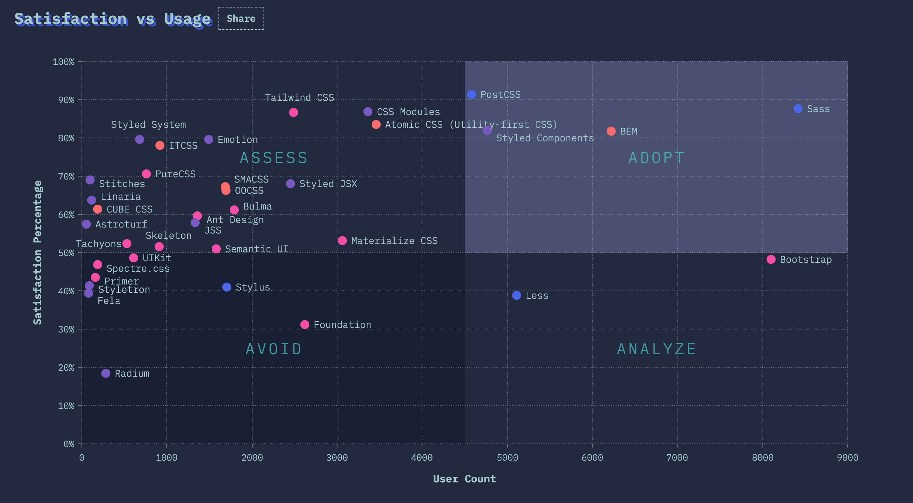

# CSS Methodology

---

# 2020 Rising star

---

---

# Functional CSS vs Semantic CSS 

[CSS Utility Classes and "Separation of Concerns"](https://adamwathan.me/css-utility-classes-and-separation-of-concerns/) - Adam Wathan

---

---

# The down side of semantic CSS

* complex methodologies(There are grey area exists in each method)
* naming conflict, css override
* hard to reuse - duplication

---

# The real reason

CSS doesn't have class scope, all classes are globally visible. So comes the hell of local classes.

---

# The new approach - Utility first CSS

---

Why not just using inline style?

---

# The good side of utility first CSS

* simple
* flexbility
* less classes

---

# Things in design system that are good to define as utilities.

* Text sizes, colors, and weights
* Border colors, widths, and positions
* Background colors
* Flexbox utilities
* Padding and margin helpers

---

# My Opinion

__Take the good part of both side.__

---

# CSS & Markup coupling

CSS depends on HTML or HTML depends on CSS?
