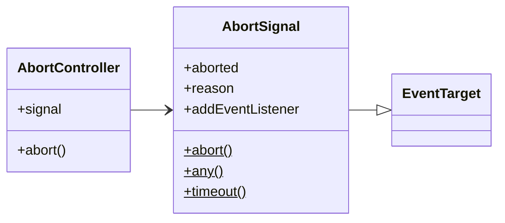

# Abort-Controller

---

# Intro

----

> The AbortController interface represents a controller object that allows you 
> to abort one or more Web requests as and when desired.
> -- MDN

----

## Components

* AbortController
* AbortSignal

----


<!-- .element: style="display:flex;justify-content:center;box-shadow:none;" -->

----

## Sample

```JavaScript
const controller = new AbortController();
const { signal } = controller;

signal.addEventListener('abort', () => {
  // Do fancy stuff
});

// ...
controller.abort();
```

---

# Basic usage

----

## Abort Event Listener

<iframe height="500" style="width: 100%;" scrolling="no" title="Abort Event Listener" src="https://codepen.io/crusoexia/embed/poMrdZX?default-tab=js%2Cresult&editable=true" frameborder="no" loading="lazy" allowtransparency="true" allowfullscreen="true">
  See the Pen <a href="https://codepen.io/crusoexia/pen/poMrdZX">
  Abort Event Listener</a> by Crusoe Xia (<a href="https://codepen.io/crusoexia">@crusoexia</a>)
  on <a href="https://codepen.io">CodePen</a>.
</iframe>

----

## A More Practical Example

```jsx []
React.useEffect(() => {
  function onMouseMove(e: MouseEvent) {
    const moveReporter = document.getElementById('move-reporter');
  
    moveReporter.textContent = `Mouse Position: X=${e.clientX} Y=${e.clientY}`;
  }
  
  document.addEventListener('mousemove', onMouseMove);
  
  return () => {
    document.removeEventListener('mousemove', onMouseMove);
  }
}, []);
```
<!-- .element: style="font-size:9pt" -->

⬇️
<!-- .element: class="fragment" data-fragment-index="1" -->

```jsx []
React.useEffect(() => {
  const controller = new AbortController();
  
  document.addEventListener('mousemove', (e: MouseEvent) => {
    const moveReporter = document.getElementById('move-reporter');
  
    moveReporter.textContent = `Mouse Position: X=${e.clientX} Y=${e.clientY}`;
  }, { signal: controller.signal });
  
  return () => {
    controller.abort();
  }
}, []);
```
<!-- .element: class="fragment" style="font-size:9pt" data-fragment-index="1" -->

----

## Abort multiple listener at once

```jsx[]
React.useEffect(() => {
  const controller = new AbortController();
  
  document.addEventListener('mousemove', (e: MouseEvent) => {
    const moveReporter = document.getElementById('move-reporter');
  
    moveReporter.textContent = `Mouse Position: X=${e.clientX} Y=${e.clientY}`;
  }, { signal: controller.signal });
  
  document.addEventListener('click', () => {
    const clickReporter = document.getElementById('click-reporter');

    clickReporter.textContent = `Mouse clicked at: ${(new Date()).getTime()}`
  }, { signal: controller.signal });
  
  return () => {
    controller.abort();
  }
}, []);
```
<!-- .element: style="font-size:9pt" -->

----

## Deeper: User controlled aborting

Suppose the page has a "Global abort" button...

```jsx[]
const { abortSignal } = props;

React.useEffect(() => {
  document.addEventListener('mousemove', (e: MouseEvent) => {
    const moveReporter = document.getElementById('move-reporter');
  
    moveReporter.textContent = `Mouse Position: X=${e.clientX} Y=${e.clientY}`;
  }, { signal: abortSignal });
  
  document.addEventListener('click', () => {
    const clickReporter = document.getElementById('click-reporter');

    clickReporter.textContent = `Mouse clicked at: ${(new Date()).getTime()}`
  }, { signal: abortSignal });
}, []);
```
<!-- .element: style="font-size:9pt" -->

----

## But... can we control it by ourselves, too?

Deeper: Abort Any

```jsx[1, 4, 10, 16, 19]
const { abortSignal } = props;

React.useEffect(() => {
  const internalController = new AbortController();

  document.addEventListener('mousemove', (e: MouseEvent) => {
    const moveReporter = document.getElementById('move-reporter');
  
    moveReporter.textContent = `Mouse Position: X=${e.clientX} Y=${e.clientY}`;
  }, { signal: AbortSignal.any([abortSignal, internalController.signal]) });
  
  document.addEventListener('click', () => {
    const clickReporter = document.getElementById('click-reporter');

    clickReporter.textContent = `Mouse clicked at: ${(new Date()).getTime()}`
  }, { signal: AbortSignal.any([abortSignal, internalController.signal]) });

  return () => {
    internalController.abort();
  };
}, []);
```
<!-- .element: style="font-size:9pt" -->

----

## Live Demo

<iframe height="500" style="width: 100%;" scrolling="no" title="Abort Event Listener - In Practice" src="https://codepen.io/crusoexia/embed/xxvLpjY?default-tab=js%2Cresult&editable=true" frameborder="no" loading="lazy" allowtransparency="true" allowfullscreen="true">
  See the Pen <a href="https://codepen.io/crusoexia/pen/xxvLpjY">
  Abort Event Listener - In Practice</a> by Crusoe Xia (<a href="https://codepen.io/crusoexia">@crusoexia</a>)
  on <a href="https://codepen.io">CodePen</a>.
</iframe>

---

# Abort fetch

----

`await fetch(url, { signal });`

----

## Example

<iframe height="500" style="width: 100%;" scrolling="no" title="Abort fetch" src="https://codepen.io/crusoexia/embed/oNKeqNb?default-tab=js%2Cresult&editable=true" frameborder="no" loading="lazy" allowtransparency="true" allowfullscreen="true">
  See the Pen <a href="https://codepen.io/crusoexia/pen/oNKeqNb">
  Abort fetch</a> by Crusoe Xia (<a href="https://codepen.io/crusoexia">@crusoexia</a>)
  on <a href="https://codepen.io">CodePen</a>.
</iframe>

----

## Timeout

```javascript
  await fetch(url, { signal: AbortSignal.timeout(300) });
```

---

# Implement Your Own Abortable API

----

Abortable API Signature:

```TypeScript
function<P, R>(param: P, options: { signal: AbortSignal }): Promise<R>
```
<!-- .element: style="font-size:14pt;" -->

----

## Sample

```JavaScript
function myCoolPromiseAPI(/* …, */ { signal }) {
  return new Promise((resolve, reject) => {
    // If the signal is already aborted, immediately throw in order to reject the promise.
    if (signal.aborted) {
      reject(signal.reason);
    }

    // Perform the main purpose of the API
    // Call resolve(result) when done.

    // Watch for 'abort' signals
    signal.addEventListener("abort", () => {
      // Stop the main operation
      // Reject the promise with the abort reason.
      reject(signal.reason);
    });
  });
}
```
<!-- .element: style="font-size:10pt;" -->

----

## Example: Elegant Timeout

```TypeScript[]
function elegantTimeout(
  callback: () => void,
  options: {
    signal?: AbortSignal;
    timeout: number;
  }
) {
  const { timeout, signal } = options;
  
  return new Promise((resolve, reject) => {
    if (signal?.aborted) {
      reject(new Error(signal.reason));  
    }
    
    const timeoutHandle = setTimeout(() => {
      callback();
      resolve();
    }, timeout);
    
    signal?.addEventListener('abort', () => {
      clearTimeout(timeoutHandle);
      reject(new Error(signal.reason));
    });
  });
}
```
<!-- .element: style="font-size:10pt;" -->

----

<iframe height="500" style="width: 100%;" scrolling="no" title="Untitled" src="https://codepen.io/crusoexia/embed/LYwjmpO?default-tab=js%2Cresult&editable=true" frameborder="no" loading="lazy" allowtransparency="true" allowfullscreen="true">
  See the Pen <a href="https://codepen.io/crusoexia/pen/LYwjmpO">
  Untitled</a> by Crusoe Xia (<a href="https://codepen.io/crusoexia">@crusoexia</a>)
  on <a href="https://codepen.io">CodePen</a>.
</iframe>

----

Further more

```jsx
React.useEffect(() => {
  const controller = new AbortController();

  document.addEventListener('click', () => {
    // Do task
  }, { signal: controller.signal });

  elegantTimeout(() => {
    // Do task
  }, { 
    signal: controller.signal,
    timeout: 0,
  });

  return () => {
    controller.abort();
  };
}, []);
```
<!-- .element: style="font-size:12pt;" -->

---

# Could I use it?

All browsers support it since *2019*.
<!-- .element: class="fragment" -->

---

# Thanks For Watching!
