autoscale: true
build-lists: true
theme: Merriweather, 8

# A Case Share - EmailEditor: The Evolution Of Design
## From Requirement To Delivery

---

# Get the requirement

---

# Analyze the requirement - System design

1. Clarify *Who is the User?*
2. Clarify *How would the User use the System?*
3. Clarify *What components does the System be made up?*
4. Clarify *How do the components interact with each other?*
5. Declare *Design criterias/outlines*
6. Pickup tech stack

---

# Design Mind Map

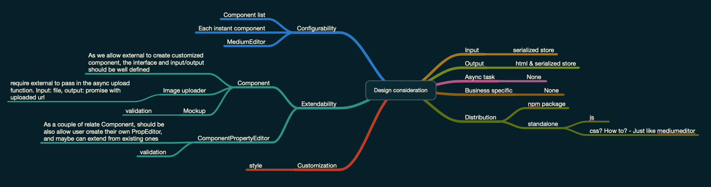

---

# Abstraction design

1. Split the Visual into small individual, self-contained parts.
2. Design API from user's perspective.
3. Analyze each *required* information in the API.
4. Draw some diagram to present the system.

---

# Draft API design

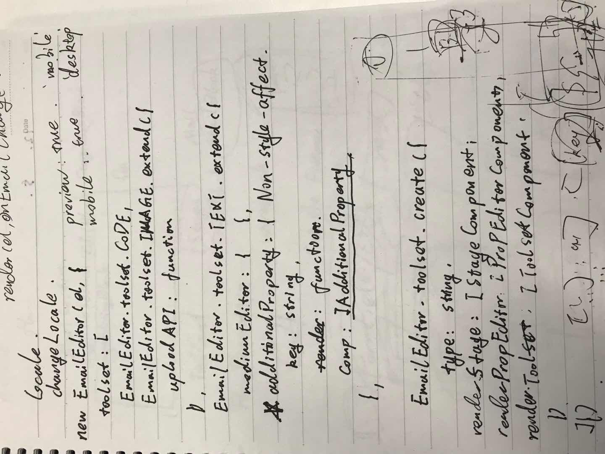

---

# Initial Abstraction design

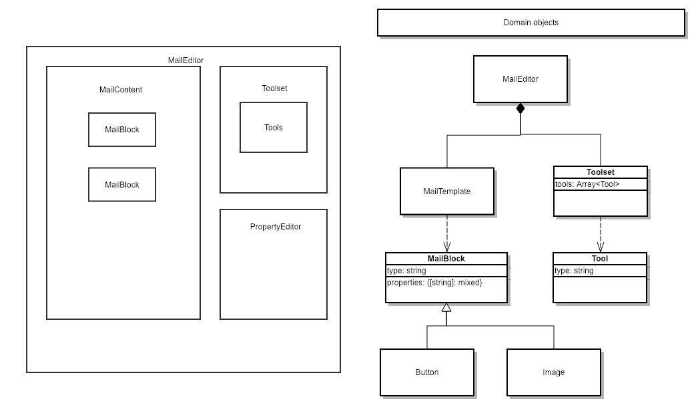

---

# Detail Design

---

# Complete the detail design in Agile

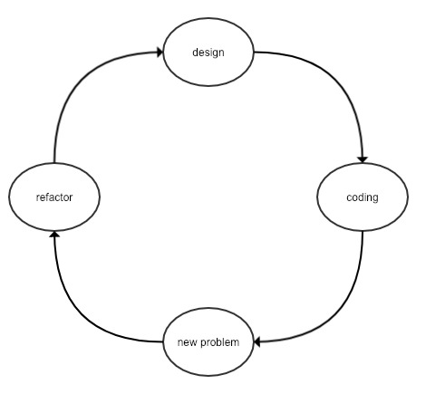

---

# A Case share - create tool

---

# The initial problem

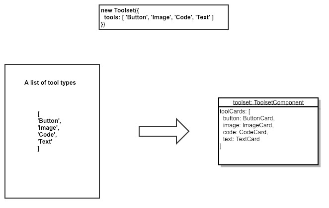

---

# The inital design

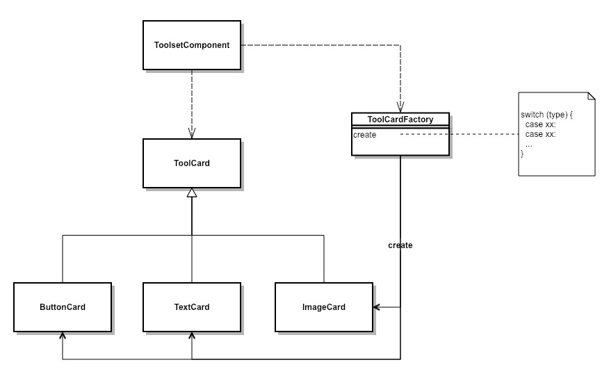

---

# A new problem

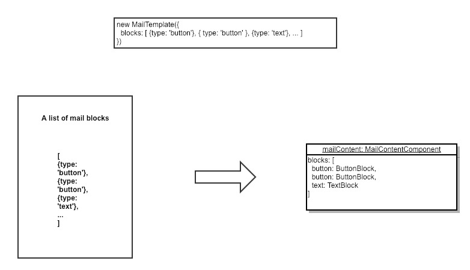

---

# Refactor

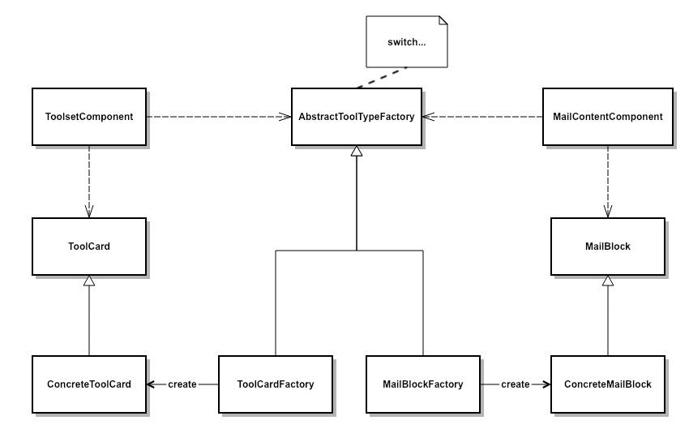

---

# Revisit the domain design

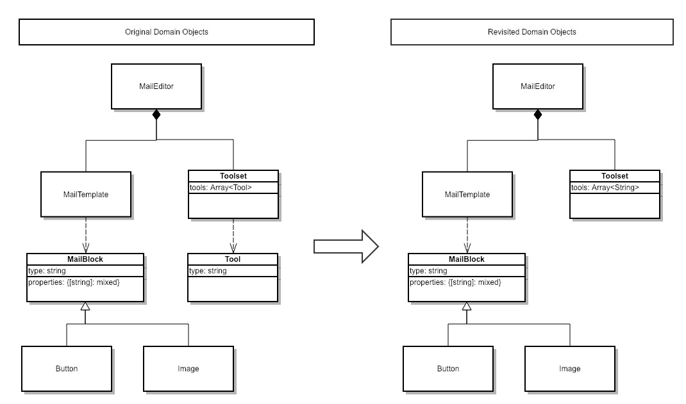

---

# Turn over - a problem that unexpected

---

# Turn over - initial naive thought

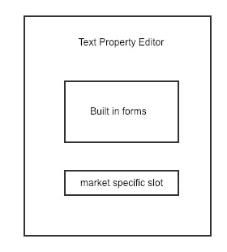

---

# lose-hair.jpg

---

# Turn over - After recall from the design criterias

* Highly Configurable
* Highly Extendable

---

# New found requirement driven out new design decision

* Give user ability to create new tools and override existing tools.
* User can use other UI framework to build tools.

---

# Rethink about the domain design base on the new decision

Found that the **Tool** is still an important concept in our system, and thinking in this way further, found:

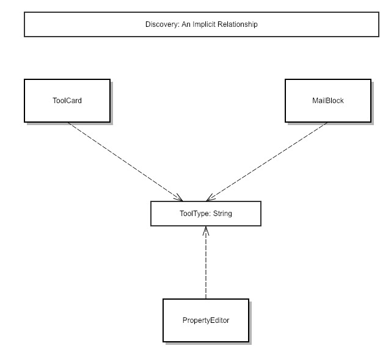

---

# Solution - The Tool domain object

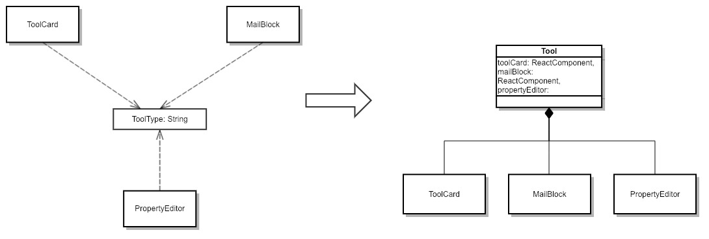

---

# Final design

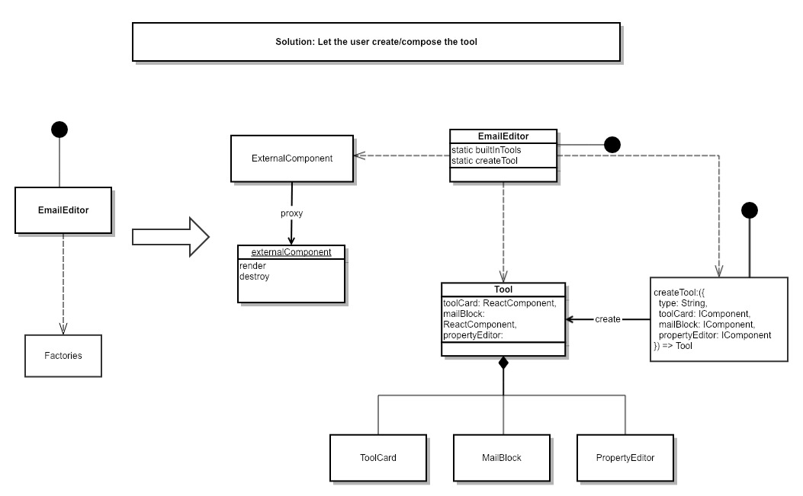

---

# Tips 1: How to make difficult design decision?

* It's just a trade-off balance

---

# Tips 2: How to convince UX to change/give up design?

* Analyze the UX from user perspective.
* Convince UX by economics, datas and facts.

---

# Flow chat of solve difficult problems.

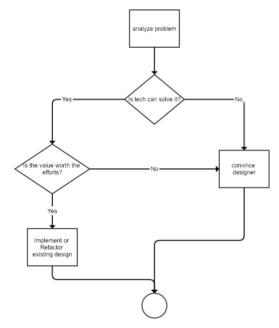
