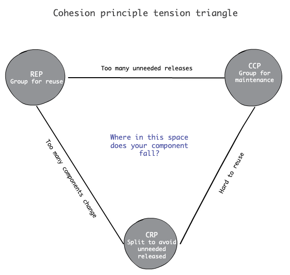
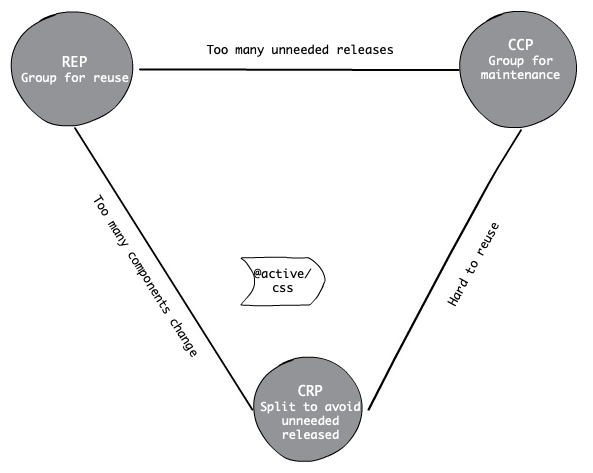

theme: Franziska, 1
build-lists: true

# Components

---

# What is component?

* Atomic unit of deployment.
* .jar, .dll, npm package.

---

# Why do we need component?

* Because we want to reuse them.

---

# Which classes belong in which component?

---

# Component cohesion

REP, CCP, CRP are the principles of component cohesion.

---

# REP

The Reuse/Release Equivalence Principle.

---

If you want to reuse something, those thing should be releasable together. - Group for reusability.

* From a software design and architecture point of view, the classes and modules that are formed into a component must belong to a cohesive group.

---

# CCP

The Common Closure Principle

---

# The problem of maintain component

* When the code must change in an application, we want all of the changes occurs in a single component rather than distibuted across many components.
* Less components are affect means less revalidating, and less redeploying. - Maintainbility

---

Gather together those things that change at the same times and for the same reasons. - Group for maintainability.

---

# CRP

The Common Reuse Principle

---

# The problem of using components.

* When new releases are coming.
* What changes those releases will bring.
* How would those changes will affect our software.

---

When we depend on a component, we want to make sure we depend on every class in that component. - Less recompile, less revalidate, less redeploy.

---

> Don't force users of a component to depend on things they don't need.

---

# Component Cohesion principles tension diagram

---

---

# @active/core

---

---

# @active/css

---

---

# endurance-common

---

---

> A good architect finds a position in that tension triangle that meets the current concerns of the development team, but is also aware that those concerns will change over time.
