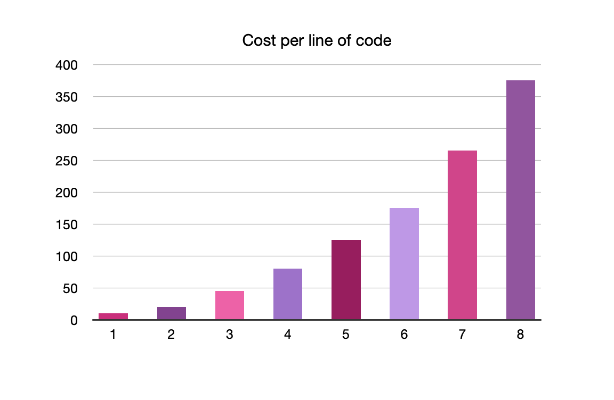

theme: Business Class, 1
build-lists: true

# What is Architecture

---

# What does a software architect do?

* A programmer; and continues to be a programmer; they are best programmers.
* Guide the rest of the team toward a design that maximized productivity.

---

# The design & architecture

* Design -> low-level
* Architecture -> high-level
* ?

---

> The low-level details and the high-level structure are all part of the same whole. They form a continuous fabric that defines the sharp of the system.

---

# What is a software Architecture?

---

> The architecture of a software system is the __Shape__ given to that system by those who build it.

---

# The form of that sharp is 

* in the division of that system into components, 
* the arrangement of those components, 
* and the ways in which those components communicate with each other.

---

# What is a good software architecture?

---

---

The goal of software architecture is to minimize the human resources required to build and maintain the required system.

---

The purpose of architecture is to ease the development, deployment, operation, and maintenance of the software system contained within it.

---

# Development

---

# Deployment

---

# Operation

---

# Maintenance

---

# What is the key of a good architecture?

---

# Software

* Software's two type of value: its behavior and its structure.
* Software was invented because we needed a way to quickly and easily change the behavior of machines.

---

# Keeping options open

* All software systems can be decomposed into two major elements: policy and details.
* The policy embodies all the business rules and procedures.
* The policy is where the true value of the system.
* What are the options that we need to leave open? -> details that don't matter.

---

The goal of the architect is to create a shape for the system that recognizes policy as the most essential element of the system while making the details irrelevant to that policy. This allows the decition of those details can be delayed and deferred.
