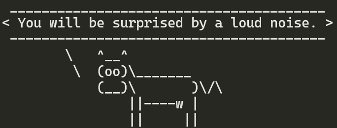
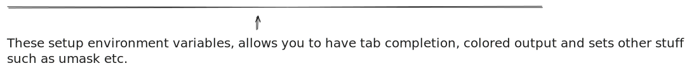
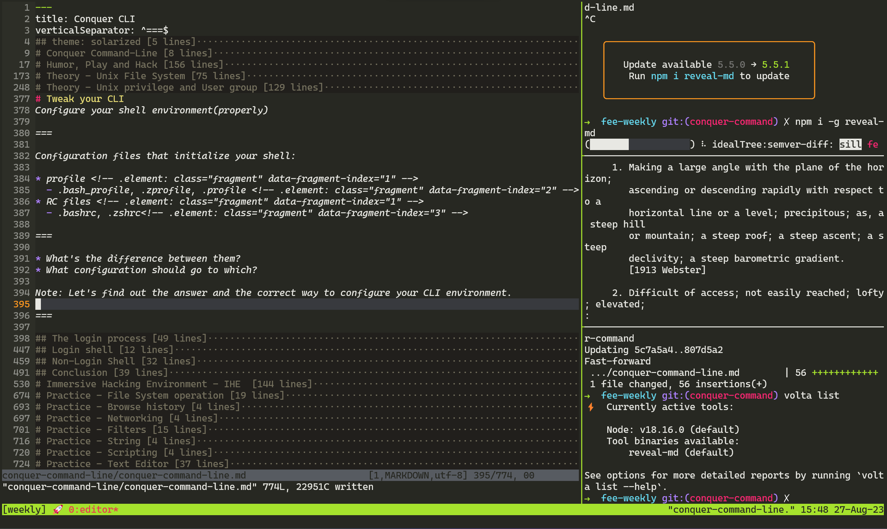
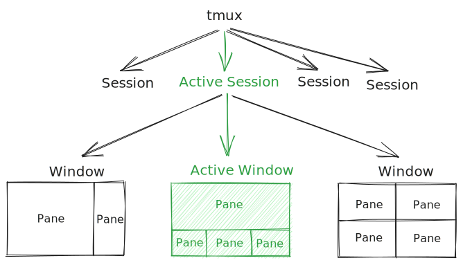

<!-- .slide: data-background="./images/the-matrix.png" -->

# Conquer Command-Line
<!-- .element: style="color: #fff" -->

Theory, Tools & Practice - be a unix hacker
<!-- .element: style="color: #fff" -->

---

# Humor, Play and Hack


<!-- .element: style="height:160px;" -->

===

## So, why do you want to use CLI?

It is third decade in the 21th Century,

_why do people still invent apps and tools with CLI interface?_

Notes: GUI is good, but it is mainly for end users, has limitation for technique tasks.

===

## Example: Move file(s).

===

Move file(s) with GUI:

1. Open "finder"(or anything else) 
<!-- .element: style="font-size:28px;margin:5px" class="fragment" data-fragment="1" -->
2. Click after clicks to get the place where the files locate 
<!-- .element: style="font-size:28px;margin:5px" class="fragment" data-fragment="2" -->
3. Select the file 
<!-- .element: style="font-size:28px;margin:5px" class="fragment" data-fragment="3" -->
4. Hold the ctrl + select another file 
<!-- .element: style="font-size:28px;margin:5px" class="fragment" data-fragment="4" -->
5. Repeat this until all the files you want to move are selected
<!-- .element: style="font-size:28px;margin:5px" class="fragment" data-fragment="5" -->
6. Right click the mouse 
<!-- .element: style="font-size:28px;margin:5px" class="fragment" data-fragment="6" -->
7. Select "cut" 
<!-- .element: style="font-size:28px;margin:5px" class="fragment" data-fragment="7" -->
8. Open another "finder" 
<!-- .element: style="font-size:28px;margin:5px" class="fragment" data-fragment="8" -->
9. Click after clicks to the target place 
<!-- .element: style="font-size:28px;margin:5px" class="fragment" data-fragment="9" -->
10. Right click mouse 
<!-- .element: style="font-size:28px;margin:5px" class="fragment" data-fragment="10" -->
11. Select the "paste"
<!-- .element: style="font-size:28px;margin:5px" class="fragment" data-fragment="11" -->

===

Tedious! &#x1F44E;

Not to mention the "finder" is really __SUCKS__.
<!-- .element: class="fragment" data-fragment-index="1" -->

===

Move file(s) with CLI:

```sh
mv ~/Downloads/*snapshot.* ~/workspace/my-project/images/
```
<!-- .element: class="fragment" data-fragment-index="1" -->

Clean & Elegant!
<!-- .element: class="fragment" data-fragment-index="2" -->

More important, it is repeatable.
<!-- .element: class="fragment" data-fragment-index="3" -->

===

__Command it__, be machine's master, not slave.

But it is not just that...
<!-- .element: class="fragment" data-fragment-index="1" -->

===

## Application cooperation
Leverage Effect

===

Imagine you want to do below task: 

1. Use a tool that generate a random humorous sentence. <!-- .element: class="fragment" data-fragment="1" -->
2. Wrapped the sentence in the bubble of a cow to make it more humorous. <!-- .element: class="fragment" data-fragment="2" -->
3. Copy it in clipboard so that you can paste it to your Wechat moments. <!-- .element: class="fragment" data-fragment="3" -->

===

With GUI applications

Suppose you have one app that generate humors, and one app to render a "cow" to wrap a sentence:
<!-- .element: class="fragment" data-fragment-index="1" -->

**Repeatly** _Double click to open app -> click to function -> copy / paste result_
<!-- .element: class="fragment" data-fragment-index="2" -->

Tedious! &#x1F44E;
<!-- .element: class="fragment" data-fragment-index="3" -->

===

With CLI:

```sh
fortune | cowsay | xclip -sel clip
```
<!-- .element: class="fragment" data-fragment-index="1" -->

&#x1F389;Voila!&#x1F389;
<!-- .element: class="fragment" data-fragment-index="2" -->

===

## Unlimited possibility - Magics from the future

===

The CLI applications would not only cooperate with each others, but they are also boost by the application which even not been created.

__Without a single-line change__.

===

Don't believe it? Check the [shell_gpt](https://github.com/TheR1D/shell_gpt)!

Now you have 10s of thousands of applications which have the world's best AI capability, __for free__!
<!-- .element: class="fragment" data-fragment-index="1" -->

===

## Other capabilities
* Scripting
* Automation

===

From here you could get idea of the power of the CLI.

===

## The deep reason that make CLI special and vibrant

1. Unified and simple input/output across the system. <!-- .element: class="fragment" data-fragment-index="1" -->
2. Each application focus on a small area. <!-- .element: class="fragment" data-fragment-index="2" -->
3. Most of the applications just "filter" the input. <!-- .element: class="fragment" data-fragment-index="3" -->
4. Application cooperation is encouraged and simply by "composition". <!-- .element: class="fragment" data-fragment-index="4" -->
-- The design principle of Unix <!-- .element: class="fragment" data-fragment-index="5" -->

===

&#x261D; Overral, the CLI is a UI created by the developers for developers, it opens a door for play and hacking.

---

# Theory - Unix File System

The fear comes from unfamiliar.

===

## Everything is a file(descriptor)

===

Documents, hard-drives, keyboard, screen, clipboards, printers, network streams... anything you can imagine, are files(with different types).

__So that the same set of tools, utilities and APIs can be used on them.__
<!-- .element: class="fragment" data-fragment-index="1" -->

===

For example

Observe the result of `ls > list.txt && cat list.txt` and `ls | cat`

Note: read.mjs

===

> In facts, _pipe_ (|) acts as a temporary file which hold the output of one command and exists until next command read it.

===

## Unix(like) file system hierarchy

Where to find the stuffs and where should you place them.

===

| Directory         | Description                                                               | Shareable |
|-------------------|---------------------------------------------------------------------------|-----------|
| **/**             | Root of the filesystem tree                                               |           |
| **/bin**          | Essential command binaries(System management tools)                       | Y         |
| /boot             | Static files of the boot loader                                           |           |
| /dev              | Device files                                                              |           |
| **/etc**          | Host-specific system configuration                                        |           |
| /etc/opt          | Configuration files for /opt                                              |           |
| /home             | User home directories                                                     |           |
| **/home/\<user>** | Login user home directory                                                 |           |
| /lib              | Essential shared libraries and kernel modules                             |           |
| **/mnt**          | Mount point for a temporarily mounted filesystem                          |           |
| **/opt**          | Add-on application software packages                                      | Y         |
| /root             | Home directory for the root user(system admin)                            |           |
| **/usr**          | Executables, libraries, and shared resources that are not system critical | Y         |
| **/usr/bin**      | Shared command binaries                                                   | Y         |
| **/tmp**          | Temporary files                                                           |           |
| **/var**          | Files that may change often – especially in size                          |           |
<!-- .element: style="font-size:20px" -->

Note: All data in Unix is organized into files. All files are organized into directories. These directories are organized into a tree-like structure called the file system.

===

/home/\<user>/ hierarchy

| Directory                | Description                                                                          |
|--------------------------|--------------------------------------------------------------------------------------|
| /home/\<user>/Documents/ | Your personal documents                                                              |
| /home/\<user>/Desktop/   | The files you place on your GUI desktop are all locate at there                      |
| /home/\<user>/Download/  | Files downloaded by user applications for example the browser.                       |
| /home/\<user>/Picture/   | Used by the photo applications and screen captures                                   |
| /home/\<user>/bin/       | Your private executables                                                             |
| /home/\<user>/.config/   | Configurations of applications                                                       |
| /home/\<user>/.local/    | Files installed by user applications other than the OS distribution package managers |
| /home/\<user>/.ssh/      | ssh related files like private/public keys and known hosts                           |
<!-- .element: style="font-size:20px" -->

---

# Theory - Unix privilege and User group

`sudo rm -rf /` &#x1F389;&#x1F389;&#x1F389;

===

## Caution!

Don't run above command in your terminal, otherwise the author of this slides don't responsible for any lost of doing so!

===

Unix is a multi-user multi-tasking OS, it has been born with consideration of dividing user's resource and privileges.

===

## Definition

* __User__ - Accounts tied either to people, or specific applications.
* __Group__ - Users within a group can read, write, or execute files owned by that group.

&#x261D; A user has an associate primary group(usually the same name as the user name).
<!-- .element: class="fragment" data-fragment-index="1" -->

&#x261D; A user can be assigned to multiple groups.
<!-- .element: class="fragment" data-fragment-index="2" -->

===

## User types

* __Normal user__ - A mortal user which would login the system.
* __System user__ - Users used by system applications or special purpose. Login is disabled.

===

Standard Users(System users)

| User   | UID | GID | Home Directory | Shell         |
|--------|-----|-----|----------------|---------------|
| root   | 0   | 0   | /root          | /bin/bash     |
| bin    | 1   | 1   | /bin           | /sbin/nologin |
| daemon | 2   | 2   | /sbin          | /sbin/nologin |
| adm    | 3   | 4   | /var/adm       | /sbin/nologin |
<!-- .element: style="font-size:.6em" -->

See the full list [here](https://access.redhat.com/documentation/en-us/red_hat_enterprise_linux/4/html/reference_guide/s1-users-groups-standard-users).
<!-- .element: style="font-size:.6em" -->

===

Standard Groups

| Group  | GID | Members           |
|--------|-----|-------------------|
| root   | 0   | root              |
| bin    | 1   | root, bin, daemon |
| daemon | 2   | root, bin, daemon |
| sys    | 3   | root, bin, adm    |
| adm    | 4   | root, adm, daemon |
<!-- .element: style="font-size:.6em" -->

See the full list [here](https://access.redhat.com/documentation/en-us/red_hat_enterprise_linux/4/html/reference_guide/s1-users-groups-standard-groups).
<!-- .element: style="font-size:.6em" -->

===

&#x261D; The "Minimal Privilege Principle" is applied to assign restricted actions to different `standard` user and groups.

===

## The sovereign Sudoers!

**sudo** stands for "Super User Do". So Sudoers are super users(root users), are usually the system owner or admin.
<!-- .element: class="fragment" data-fragment-index="1" -->

&#x261D; The sudoers' specification are stored in `/etc/sudoers`
<!-- .element: class="fragment" data-fragment-index="2" -->

===

## User and Group management tools

Refer to [Redhat User and Group Management Tools](https://access.redhat.com/documentation/en-us/red_hat_enterprise_linux/4/html/reference_guide/ch-users-groups)

===

## Practice: Check user groups

`id [options] [user]`

```sh
$ id root
```
Output:

uid=0(root) gid=0(wheel) groups=0(wheel),1(daemon),2(kmem),3(sys),4(tty),5(operator),8(procview),9(procmod),12(everyone),20(staff),29(certusers),61(localaccounts),80(admin),702(com.apple.sharepoint.group.2),701(com.apple.sharepoint.group.1),33(_appstore),98(_lpadmin),100(_lpoperator),204(_developer),250(_analyticsusers),395(com.apple.access_ftp),398(com.apple.access_screensharing),399(com.apple.access_ssh),400(com.apple.access_remote_ae),703(com.apple.sharepoint.group.3)
<!-- .element: style="font-size: .5em;overflow-wrap:break-word;text-align:left" -->

===

## File Permission

* Each file has 3 level of permission `read`, `write`, and `execute` separately for the `user owner`, the `group owner`, and `others`.
* The file owner can be changed only by the root user. <!-- .element: class="fragment" data-fragment-index="1" -->
* File access permissions can be changed by both the root user and the owner of the file. <!-- .element: class="fragment" data-fragment-index="2" -->

===


===

&#x261D; Dy default the user who creates a file is the owner that file. The creator's primary group is the group owner of the file.

&#x261D; There are more advanced permission controls like `special permission` and `ACL`(Access control list).
<!-- .element: class="fragment" data-fragment-index="1" -->

===

## The privilege of process

The process and its sub-processes have the same access right as the user who start the process.

&#x261D; Don't abuse *sudo* to run applications! That means this application can do anything on your system(like `rm -rf /`), so does the sub-processes spawned by it.
<!-- .element: class="fragment" data-fragment-index="1" -->

---

# Tweak your CLI
Configure your shell environment(properly)

===

Configuration files that initialize your shell:

* profile <!-- .element: class="fragment" data-fragment-index="1" -->
  - .bash_profile, .zprofile, .profile <!-- .element: class="fragment" data-fragment-index="2" -->
* RC files <!-- .element: class="fragment" data-fragment-index="1" -->
  - .bashrc, .zshrc<!-- .element: class="fragment" data-fragment-index="3" -->

===

* What's the difference between them?
* What configuration should go to which? 

Note: Let's find out the answer and the correct way to configure your CLI environment.

===

## The login process

===

Consider below command:

```sh
echo $USER $UID $HOME $SHELL
cxia 1000 /home/cxia /bin/zsh
```
<!-- .element: class="fragment" data-fragment-index="1" -->

How does these _variables_ got initialized?
<!-- .element: class="fragment" data-fragment-index="2" -->

===

When a UNIX system starts up, the first program would be `/sbin/init`(or might be `/usr/bin/systemd` in Linux). 
<!-- .element: style="text-align: left" -->

===

This _init_ would run below in order:
<!-- .element: style="text-align: left" -->

1. Start multiple "getty";
<!-- .element: class="fragment" data-fragment-index="1" style="font-size:.7em" -->
2. One of the "getty" detects your connection, prompt to ask your user name, run the "/bin/login";
<!-- .element: class="fragment" data-fragment-index="2" style="font-size:.7em" -->
3. The "login" prompt to ask your password, examines the "/etc/passwd" to verify your credential, set up your environment;
<!-- .element: class="fragment" data-fragment-index="3" style="font-size:.7em" -->
```sh
root:*:0:0:System Administrator:/var/root:/bin/sh
          ^                        ^         ^
          |                        |         |
        $UID                     $HOME     $SHELL
```
<!-- .element: class="fragment" data-fragment-index="4" -->
4. The "login" run your login program; set the login flag to program;
<!-- .element: class="fragment" data-fragment-index="5" style="font-size:.7em" -->
5. "bash" starts with the awareness with the flag that it is the "login shell", it sources the "profiles" and RC files and provide the interactive session for you.
<!-- .element: class="fragment" data-fragment-index="6" style="font-size:.7em" -->

===


===

## Login shell

Use "bash" for example, when a shell detects it is a `login-shell`, it source the configuration files in below order:
<!-- .element: class="fragment" data-fragment-index="1" -->


<!-- .element: class="fragment" data-fragment-index="2" style="margin-bottom:0" -->

<!-- .element: class="fragment" data-fragment-index="3" style="margin-top:-60px"-->

===

## Non-Login Shell

Other than the "login shell", you can have many other shells running at the same time in your system. 
<!-- .element: class="fragment" data-fragment-index="1" -->

===

You starts a new shell process when:

1. Starts a interactive shell in your current shell. 
<!-- .element: class="fragment" data-fragment-index="1" -->
2. Run a shell script begin with the "#!/bin/bash". 
<!-- .element: class="fragment" data-fragment-index="2" -->

&#x261D; These are __non-login__ shell.
<!-- .element: class="fragment" data-fragment-index="3" -->

===

### The initialization of non-login shell

1. Environment variables are inherited from the shell (or other process) that created it.
<!-- .element: class="fragment" data-fragment-index="1" -->
2. The file $HOME/.bashrc is sourced to allow for other kinds of customization.
<!-- .element: class="fragment" data-fragment-index="2" -->

===

&#x261D; You might notice that the "alias" would not be inherited from the parent shell. If you place the "alias" in the "profile", the non-login shells would not recognize them.

===

## Conclusion


* Put the "environment variables" and "PATH" exports in the "profile". <!-- .element: class="fragment" data-fragment-index="2" -->
* Put the "alias" and other customization per shell process in the RC files.<!-- .element: class="fragment" data-fragment-index="3" -->

Note: Now you know how to properly arrange your configurations

===

**Tips** - Check whether your are using a login shell

```sh
➜  ~ echo $0
-zsh
➜  ~ bash

The default interactive shell is now zsh.
To update your account to use zsh, please run `chsh -s /bin/zsh`.
For more details, please visit https://support.apple.com/kb/HT208050.
bash-3.2$ echo $0
bash
bash-3.2$
```

The "-" indicates that it is a login shell
<!-- .element: class="fragment" data-fragment-index="1" -->

===

**Tips**: The first program for non-login user

```sh
daemon:*:1:1:System Services:/var/root:/usr/bin/false
```
<!-- .element: class="fragment" data-fragment-index="1" -->

---

# Zen - IHE 

Setup your _Immersive Hacking Environment_.

工欲善其事，必先利其器

===



===

## But... WHY?

The things you show us looks ancient, the learning curve is steep, and we already have _IDEs_, why should I bother with them? 

===

__Benefits__

* Summon, instead of seeking in the jungle
* Declarative, what you think is what you get
* Consistent control/communication method across programs
* Unbelievable customizability
* Automation

===

_CLI_ is another way(and the original way) of communication with the computer, there are tools can vastly boost this communication with accuracy and efficiency.

===

Unix作为一个良好的开发环境长期以来享有盛誉。许多程序员为程序员而写的工具使它配备精良。这些工具自动完成了不少琐碎的工作，从而让人心无旁骛地专注于开发中最重要（也是最享受）的部分——设计。

攀爬学习曲线的一次性付出，得到的是更有效编写程序的能力；精力也可以更多地放在设计层面而不是低层次的细节操作。

-- _The Art Of Unix Programming_

===

For me, looking at the computer follows my mind and finger, loyally working on what I asked is a pure part of joy. This feeling is GOOD.

===

Ususaly I use the _IHE_ to:

* Common computing tasks
* Writing / Documentation
* Take notes
* Dictionary
* Coding
* Read news
* Read/Send emails
* ...

===

# The Tools

===

## Terminal

===

Terminals are many, but there is a critical capability to filter them: *Standby for your call with an identified command*.


<!-- .element: class="fragment" style="height: 400px" data-fragment-index="1" -->

===

Compare with searching in a messed list with `tab` and eyes(and brain), using `ctrl/cmd + ;` to summon and dismiss the terminal is JUST elegant!

===

Recommond terminals:

* Mac - *iterm2*
* Windows - *Windows terminal*
* Linux - *Guake*; *Gnome terminal*

===

## tmux
The magic amplifier.

Get what you need right at your hand.

Now you have your CLI, you still want diff workspaces for different things, and a way to quick and accuate switch between them.

===

> 但是用户经常更愿意有一个大的环境让它们能够指向文本部分，无需花费时间和精力在拥有相同文件名或是相同剪切内容的程序之间切来切去。

===

https://www.redhat.com/sysadmin/introduction-tmux-linux

===

Introduct concepts

Session, Window, Pane

===



===

* Session management
  - Create Session
  - Attach Session
  - Switch Session
* Window management
  - Create Window
  - Window navigation
  - Search/Switch Window
  - Swap window
  - Move window to session
* Pane management
  - Create Pane
  - Pane navigation
  - Pane position
  - Move Pane to window

===

Tmuxinator

Predefined tmux workspace

===

## oh-my-zsh

Capability enabled:
* auto-completion
* better autojump
* better vi-mode
* better history management
* pretty
* and more

===

One downside of the CLI is you have to remember the commands and their options(usability). 

__Auto-completion__ can dramatically resolve this problem.
<!-- .element: class="fragment" data-fragment-index="1" -->

===

## auto-jump

---

# Practice - File System operation

===

## Symbolic link

===

* create directory
* create file
* change user and group
* change permission
  - absolute mode
  - symbolic mode

see: https://www.redhat.com/sysadmin/manage-permissions

---

# Practice - Browse history

---

# Practice - Networking

---

# Practice - Filters

===

fdfind
fzf
head
less
more
tail
grep
repgrep

---

# Practice - String

---

# Practice - Scripting

---

# Practice - Text Editor

The Holy War 

Note: (between emacs and vim)

===

## Introduction

The relationship with "ed".

===

See <the art of unix programming> p.328 - the "roguelike" pattern

===

gx

===

Command: Predicate [ - Scope ] - Quantifiers

vi拥趸特别吹捧的一个命令集特性就是继承来自ed的对象操作格式。大多数扩展的命令也可以自然地用于任何行范围。

e.g.

dd
dj
dk
daw
d2w
d3j

---

# Practice - System management

---

# Practice - Git

---

# References
* [Filesystem Hierarchy Standard](https://www.pathname.com/fhs/)
* [adduser manual](https://www.commandlinux.com/man-page/man8/addgroup.8.html)
* [Sudoers](https://help.ubuntu.com/community/Sudoers)
* [Login shell](https://linuxhandbook.com/login-shell/)
* [Login and rc files, the login process](https://www.usna.edu/Users/cs/wcbrown/courses/IC221/classes/L03/Class.html)
