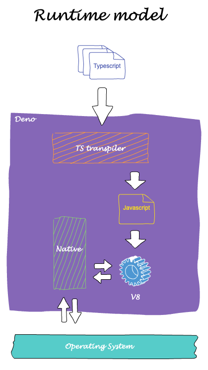
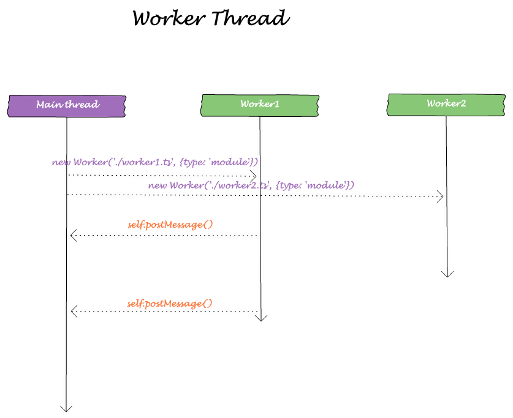
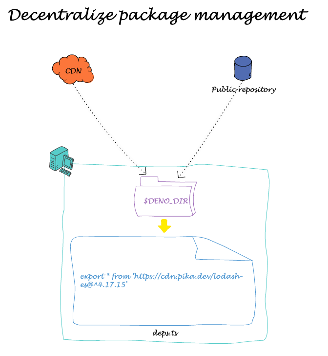

autoscale: true
theme: Sketchnote, 1

# Deno: A Glance

---

# Installation

```shell
brew install deno
```

```shell
curl -fsSL https://deno.land/x/install/install.sh | sh
```

---

# Built-in Typescript support

---



---

# ES module

## Doesn't support CJS

---

# Web standard compatible API

* window
* self
* fetch
* addEventListener
* Event
* Location
* etc.

---

# Security

---



---



---

# Dependency management

---

# Where to find third-party packages

* [Pika](https://www.pika.dev/search)
* [deno.land](https://deno.land/x/)

---

# Task runner

* Makefile
* [drake](https://deno.land/x/drake/)

---

# Built-in tools

* Testing runner
* Doc generation
* Bundling

---

# IDE support

* VS Code

---

# Current status look ahead / Discussion

---

# Resources

* [Deno handbook](https://www.freecodecamp.org/news/the-deno-handbook/)
