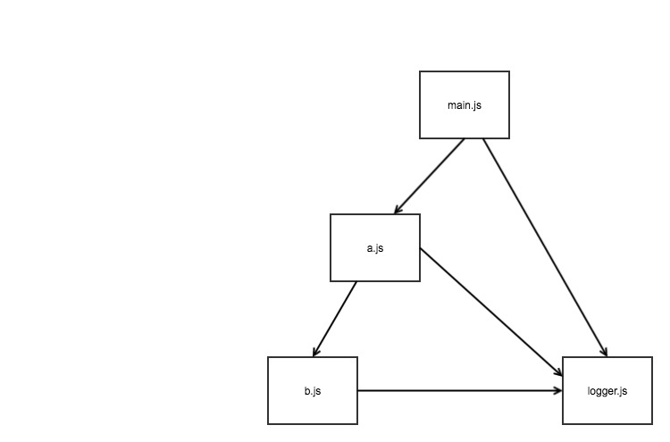
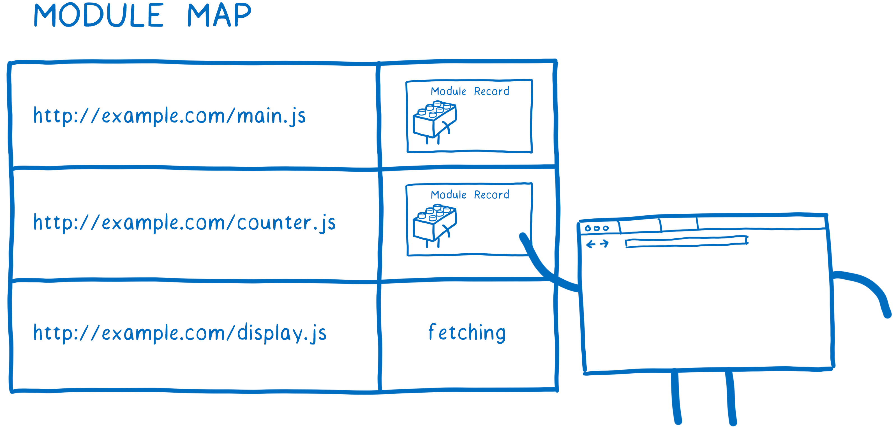
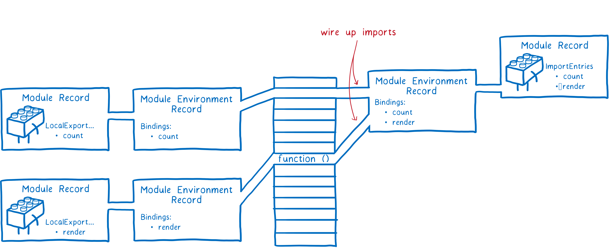
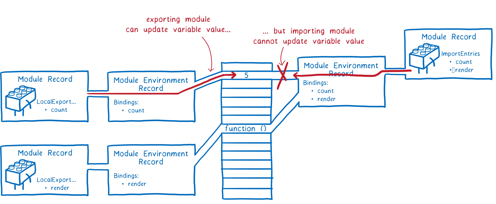
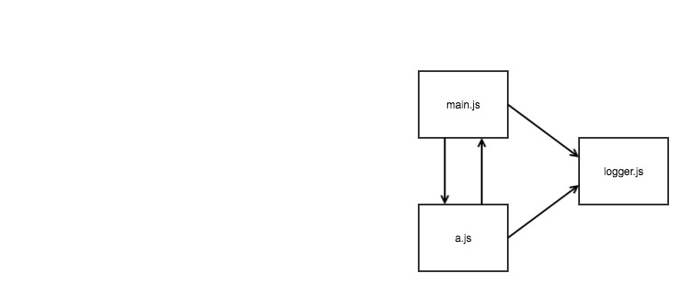

autoscale: true
build-lists: true

# ES module in browser

---

# Browser support

---

# Demo

---

# Imports

^ one module imported by two

---

# The progress

---

# Parse

---

# Instantiation

* All about wire things up.
* From deepest module.

---

# Evaluation

* From deepest module.
* The code in the module will be executed.
* Export module can update the exported values, import module cannot update the imported values.

---

# Cyclic demo

---

# Look ahead

* It unified the module loader in browsers, make code easier to reuse / deploy, encourage the isomophic modules.
* The import syntax is not standard
* Tools to bundle the modules to chunks are still required
