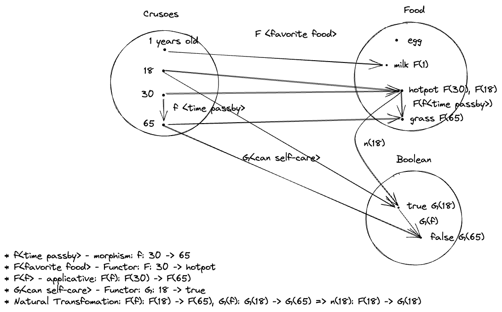

theme: Huerta, 6
autoscale: true

# Algebraic JavaScript


[.footer: Algebraic structures defined in [Fantasy Land](https://github.com/fantasyland/fantasy-land) which inspired by Haskell.]

---

# Algebra

> An algebra is a set of values, a set of operators that it is closed under and some laws it must obey.
> -- [Fantasy Land](https://github.com/fantasyland/fantasy-land#general)

---

# What does it matter to programming?

* Using the power of algebra(_Category theory_) to solve programming problem.

---

# Functional programming languages

* Erlang
* Lisp(Common Lisp; Closure)
* __Haskell__(pure functional)
* __Elm__
* Kitlin
* Scala
* PureScript
* __JavaScript__(multi-paradigm)
* ...

---

# A glance of Haskell

* __General-purpose__, __statically-typed__, __purely functional__ programming language with __type inference__ and __lazy evaluation__.[^3]
* Designed by scientist, mathenmatician.
* Used in academia, industry.

[^3]: [wikipedia](https://en.wikipedia.org/wiki/Haskell)

---

# Category Theory, Again

* Categories[^1]
* Objects
* Morphisms(Functors)
* Natural transformation(Morphism of Functors)[^2]

[^1]: [See the "three mathematical entites" of Category](https://en.wikipedia.org/wiki/Category_theory#Categories)

[^2]: [Natural transformation](https://en.wikipedia.org/wiki/Natural_transformation)

---

# An real life example to explain Category Theory



---

# Basic concepts

* typeclass
* Container
* Functor
* Monad
* Applicative
* Traversable

---

# Typeclass

Typeclass is the interface of type behaviors. If a type is an instance of typeclass, the type must implement the behavior defined in the typeclass.

---

# Putting the value into box - Container.


The container "F" hosts the value "a".

---

# What is "Container"

[.column]
The ability and a standard way to wrap values within some context for _Functors_ to easily encapsulate their laws.

In native fp languages like Haskell and Elm, there is not a concept called "Container". It is just natural to host value in type structures.

[.column]
```javascript
// Container defined in mostly-adequate-guide 
class Container {
  constructor(x) {
    this.$value = x;
  }

  static of(x) {
    return new Container(x);
  }
}
```

```javascript
// Sanctuaryjs
S.Just(1);
```

```haskell
-- haskell
Just 1
```

---

# Functor


* “Functors” are the containers that can be used with “map” function obey some law. - _Mostly Adequate Guide_
* Functor is a __typeclass__ which's intance must implement the `map` function. - _Haskell_

---

# Interesting facts of Functor

* Different Functor has different implementation of `map`.
* We safely keep the operation inside the Container, which can achieve some mighty effect like lazy evaluation, change impure action to pure action.
* The result of the `map` is also a Functor, which means it can keep `map` away, it is the base infrastructure for composition.

---

# Monad

* you apply a function that returns a wrapped value, to a wrapped value using >>=
* Monad is any data type that defines how “fmap” applies to it. - _Haskell_

---

# Applicative

Functor of Morphisms.

---

# Traversable

Natural transformation between Functors.

---

# JavaScript libraries:

* Ramda
* Sanctuary
* Monio

---

# References

* Learn You a Haskell for Great Good
* Fantasy Land
* Mostly Adequate Guide
* Math Is Fun
