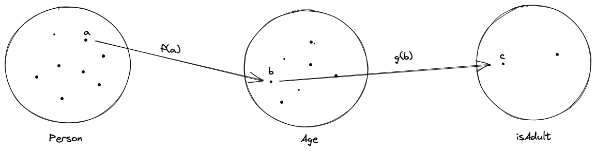
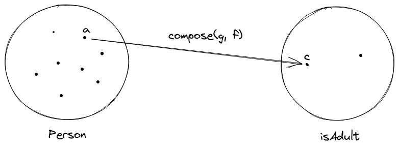

theme: Huerta, 6

# FP 101

---

# What is functional programming?

---

# Pilars of OOP
* Encapsulate(State and behavior)
* Inherit
* Polymorphism

## Good at modeling __Things__.

---

# Pilars of FP
* Immutability
* Purity
* Composition

## Good at handle __Collection__ and __Async Programming__.

---

# Immutability
* Create, Initialize and Use values or objects.
* Unable to update them.
* Create new one whenever updates is wanted.

## Easy to reason about; Async programming.

---

# Purity
* Same input will always result to same output.
* No __Side Effect__.

## Easy to reason about; Memorization; Async programming.

---

# Composition
* Simple and pure modules.
* Compose simple steps into a whole picture.

## Extend funcationality.

> Module principle: Use clean interface to compose simple modules.
> - The Art of UNIX Programming

---

# Live FP examples
* Unix CLI pipeline
* Redux reducer

---

# OOP VS FP
* Stateful __VS__ Purity
* Mutation __VS__ Immutability
* Inherit, Override & Polymorphism __VS__ Composition & Transformation

## A little game

[Battle between object chainning & composition](https://codepen.io/crusoexia/pen/MWQqdXv)

---

# Category Theory
* A colletion of __objects__ - Sets of all possible values in a certain type.
* A collection of __morphisms__ - Functions.
* A notion of __composition on the morphisms__ - Composition of Functions.

> When we are talking about Functional Programming, we are talking about Mathematics.

---

# Composition On Morphism
## g(f(a)) === compose(g, f)(a) === c

---

# What you will learned in this series
* Basic FP concepts and terminologies.
* Special type abstruction as __Functor__, __Monad__, __Applicatives__ etc.
* Use FP paradigm to solve common programming problems.

---

# References
* [Mostly Adequate Guide](https://mostly-adequate.gitbook.io/mostly-adequate-guide)
* [JavaScript function composition: What’s the big deal?](https://jrsinclair.com/articles/2022/javascript-function-composition-whats-the-big-deal/)
