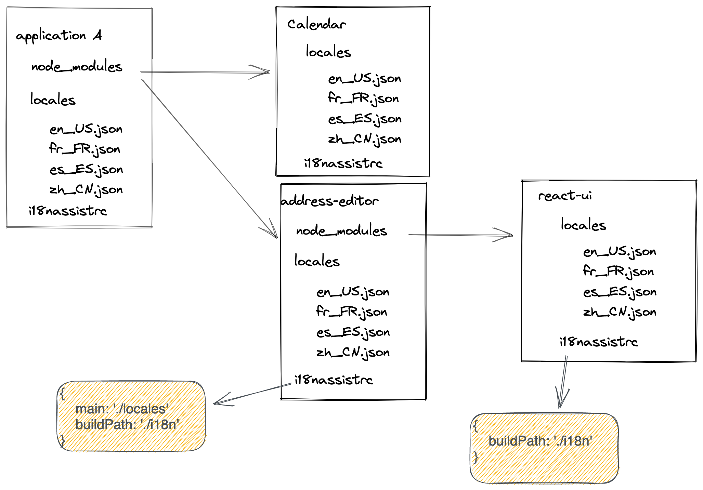
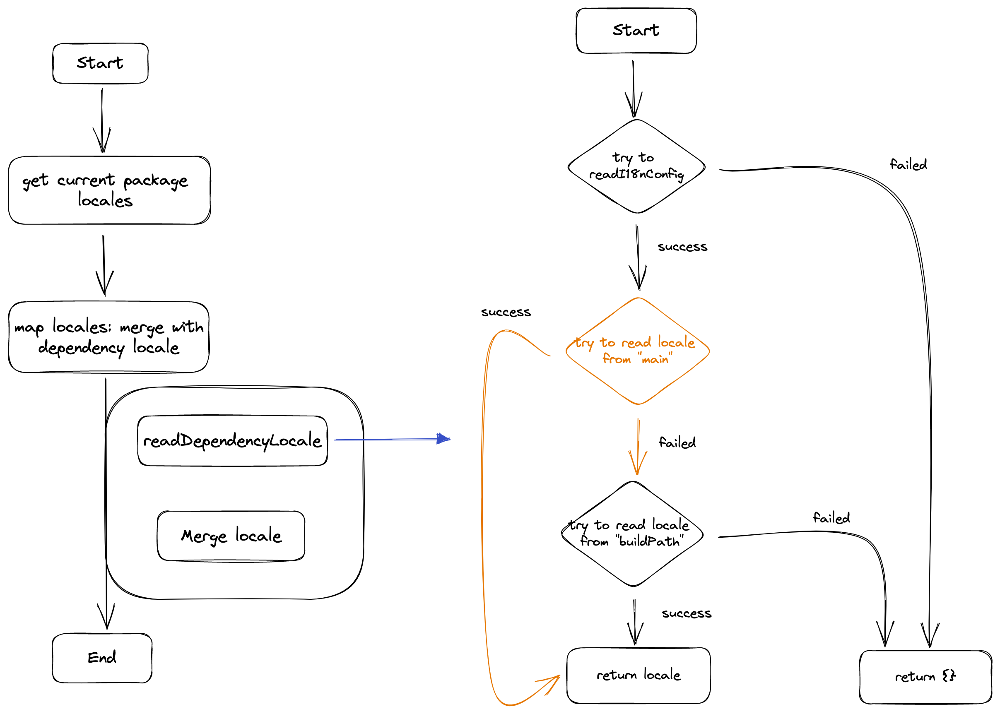

theme: Plex, 1

# Functors

---

# Functor typeclass

__Haskell__:
> Functor is used to present the thing that can be mapped. 
> Any type that has the __Container Property__ can be regarded as Functtor 

Functor in Haskell:

```haskell
class Functor f where
  fmap :: (a -> b) -> f a -> f b
```

---

# Array - List Functor

Array(List) is a Functor due to obey the __Functor laws__ and the implementation of __fmap__.

```javascript
const add = curry((a, b) => (a + b));

[ 1, 2, 3 ].map(add(10)) // [ 11, 12, 13 ]
```

---

# fmap of Functor

Functor defines one function `fmap`, it doesn't have default implementation, every concrete type of Functor should implement it.

Through the abstruct `fmap`, we can provide whatever Functor to it, and the concreted `fmap` method will be called. This is __polymorphic__ of `fmap`.

```javascript
const fmap = curry((fn, f) => f.map(fn));

const div = curry((a, b) => (a / b));

compose(
  fmap(div(2)),    // [ 50.5, 51, 51.5 ]
  fmap(add(100)),  // [ 101, 102, 103 ]
)([ 1, 2, 3 ]);
```

---

# Maybe

> Maybe you are a robot.

__Haskell__:

```Haskell
data Maybe a = Nothing | Just
```

```Haskell
instance Functor Maybe where
  fmap f (Just x) = Just (f x)
  fmap f Nothing = Nothing
```

---

# JavaScript Maybe

[.column]

"Mostly Adequate guide" implementation:

```javascript
class Maybe {
  get isNothing() {
    return this.$value === null || this.$value === undefined;
  }

  constructor(x) {
    this.$value = x;
  }

  static of(x) {
    return new Maybe(x);
  }

  map(fn) {
    return this.isNothing() ? this : Maybe.of(fn(this.$value));
  }
}
```

[.column]
Sample

```javascript
const getName = man => man.name;

const greeting = name => (`Hello ${name}`);

Maybe
  .of({ name: 'John' })
  .map(getName)
  .map(greeting); // Maybe 'Hello John'

Maybe
  .of(undefined)
  .map(getName)
  .map(greeting); // Maybe Nothing
```

[.footer: The power of "Maybe": we can keep map functions to it without care whether the value is nullish.]

---

# maybe - Pickup value from "Maybe"

```javascript
const maybe = curry((v, f, m) => {
  if (m.isNothing) {
    return v;
  }

  return f(m.$value);
});

```

---

# Usage

```javascript
const getName = ppl => ppl.name;

const greeting = name => (`Hello ${name}`);

const maybeSayHi = compose(maybe('You are not a human.', greeting), map(getName), Maybe.of);

maybeSayHi({ name: 'John' })  // 'Hello John'
maybeSayHi({ nam: 'Jane' })   // 'You are not a human'
maybeSayHi(null)              // 'You are not a human'
```

---

The Maybe functor provide us an elegant way to handle the nullish situations.

## Practice: [Cabinet Box](https://codepen.io/crusoexia/pen/MWGYeZM)

---

# 4. Either

Either allow us to create branch in the composition pipeline. It can seamlessly replace the __try - catch__ statement and more.

[.column]
```javascript
class Either {
  constructor(x) {
    this.$value = x;
  }
}
```

[.column]
```javascript
class Left extends Either {
  get isLeft() {
    return true;
  }

  get isRight() {
    return false;
  }

  static of(x) {
    return new Left(x);
  }

  map() {
    return this;
  }
}
```

[.column]
```javascript
class Right extends Either {
  get isLeft() {
    return false;
  }

  get isRight() {
    return true;
  }

  static of(x) {
    return new Right(x);
  }

  map(fn) {
    return Right
      .of(fn(this.$value));
  }
}
```

---

# Sample

```
const double = x => x * 2;

S.pipe([ S.map(double), S.map(double) ])(S.Right(3)) 
// Right 12

S.pipe([ S.map(double), S.map(double) ])(S.Left('Not a number')) 
// Left 'Not a number'

S.pipe([ S.map(double), S.map(double) ])(S.Left(3)) 
// Left 3
```

---

# either - pickup the value from "Either"

[.column]
```javascript
// either :: (a -> c) -> (b -> c) -> Either a b -> c
const either = curry((f, g, e) => {
  let result;

  switch (e.constructor) {
    case Left:
      result = f(e.$value);
      break;

    case Right:
      result = g(e.$value);
      break;
  }

  return result;
});

```

[.column]
Usage

```javascript
const fortune = age => (`If you survive, you will be ${age}`);
const getAge = num => {
  try {
    return S.Right(Number.parseInt(num));
  } catch {
    return S.Left('Birth date could not be parsed.');
  }
}

S.either(S.Id)(fortune)(getAge('10'));
// 'If you survive, you will be 10'

S.either(S.Id)(fortune)(getAge('Some date'));
// 'Birth date could not be parsed'
```

---

# 5. IO

The magic to change impure to pure.

[.column]
```javascript
class IO {
  constructor(fn) {
    this.unsafePerformIO = fn;
  }

  static of(x) {
    return new IO(() => x);
  }

  map(fn) {
    return new IO(compose(fn, this.unsafePerformIO));
  }
}
```

[.column]
* It wrap the __effect function__ within the container.
* When mapping the __IO functor__, it just compose the functions without actual execute them, that's why it is pure.
* It only execute the side effect when explicty execute the __perform__ function.

[.footer: It is also indicate the ability of lazy evaluation.]

---

# Advanced Algebraic Data Types

Dealing with complicate cases.

* Applicative
* Monad
* Monoid
* Traversble

---

# Applicative

The ability to apply __Functor(function)__ to __Functor datas__.

```javascript
const plus = S.curry2((a, b) => b + a);
const multi = S.curry2((a, b) => b * a);
const divide = S.curry2((a, b) => b / a);
const append = S.curry2((suffix, str) => str + suffix);

// Maybe Applicative
S.ap(S.Just(append('!')))(S.Just('WoW')); // Just "WoW!"
S.ap(S.Just(append('!')))(S.Nothing); // Nothing
S.ap(S.Nothing)(S.Just('WoW')); // Nothing

// Either Applicative
S.ap(S.Right(append('!')))(S.Right('WoW')); // Right "WoW!"
S.ap(S.Right(append('!')))(S.Left('ops')); // Left 'ops'
S.ap(S.Left(append('!')))(S.Right('WoW')); // Left function

// Array Applicative
S.ap([ plus(1), multi(2), divide(3) ])([ 6 ]); // [ 7, 12, 2 ]
```

[live code](https://codepen.io/crusoexia/pen/xxzGNwM)

---

# Monad

The ability to map Functor data to functions which accept normal data and returns a Functor(_Functor f => a -> f b_).

```javascript
const double = (x) => S.Just(x * 2);

S.pipe([
  S.chain(double),
  S.chain(double),
])(S.Just(2));

// Just 8
```

[live code](https://codepen.io/crusoexia/pen/YzvyNZQ?editors=0012)

---

# A real life example

[i18nassist compile command](https://gitlab.dev.activenetwork.com/fee/i18nassist/-/blob/master/src/scripts/compile.js)



---

# Flowchart



---

# Code - Without Functors

```javascript
const readDependencyLocale: Function = curry((locale: string, moduleName: string) => {
  let depConfig;

  try {
    depConfig = readJSONFile(joinPath(moduleName, I18NASSIST_FILE));
  } catch {
    return {};
  }

  try {
    return readJSONFile(
      combinePackageLocaleFilePath(locale, moduleName, depConfig, 'main'),
    );
  } catch {
  }

  try {
    return readJSONFile(
      combinePackageLocaleFilePath(locale, moduleName, depConfig, 'buildPath'),
    );
  } catch {
    return {};
  }
});
```

---

# Code - After refactored with Functors

```javascript
const readLocaleFromLocation = (locale: string, pkgName: string, cfg: Config) => S.pipe([
  S.lift2(combinePackageLocaleFilePath(locale)(pkgName))(cfg),
  S.chain(readJSONFile),
]);

const readDependencyLocale: Function = curry((locale: string, pkgName: string) => {
  const pkgConfig = readJSONFile(joinPath(pkgName, I18NASSIST_FILE));
  const possibleLocaleLocations = [ S.Right('main'), S.Right('buildPath') ];

  return S.pipe([
    S.map(readLocaleFromLocation(locale, pkgName, pkgConfig)),
    S.rights,
    S.head,
    S.maybe({})(S.I),
  ])(possibleLocaleLocations);
});
```

---

# Flowchart - after refactored with functor


---

# Conclusion

* Functional programming enbrace Purity, Immutability and composition.
* Composition is a data transformation pipeline, we can easily add/remove function plugins to modify the pipeline.
* High order function and generic type make it easy to extend existing functionality.
* Curry and partial application allow us separate the time and space to apply arguments.
* Functor provide the ability to wrap data with context. It allows us to build composition pipeline in more complicate cases.
* There are plenty efficient consistent APIs like "map", "fold(reduce)" to manipulate Functors.

---

# References

* Learn You a Haskell for Great Good
* Mostly Adequate Guide
* [Sanctuary](https://sanctuary.js.org/)
