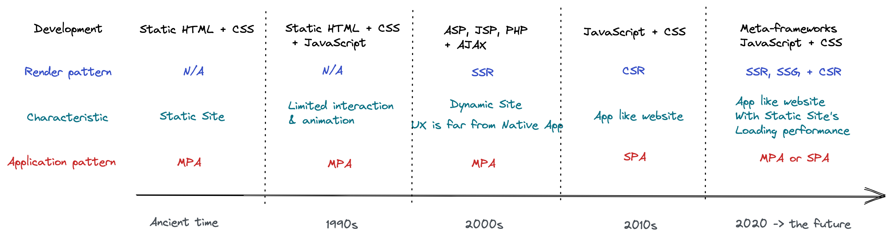
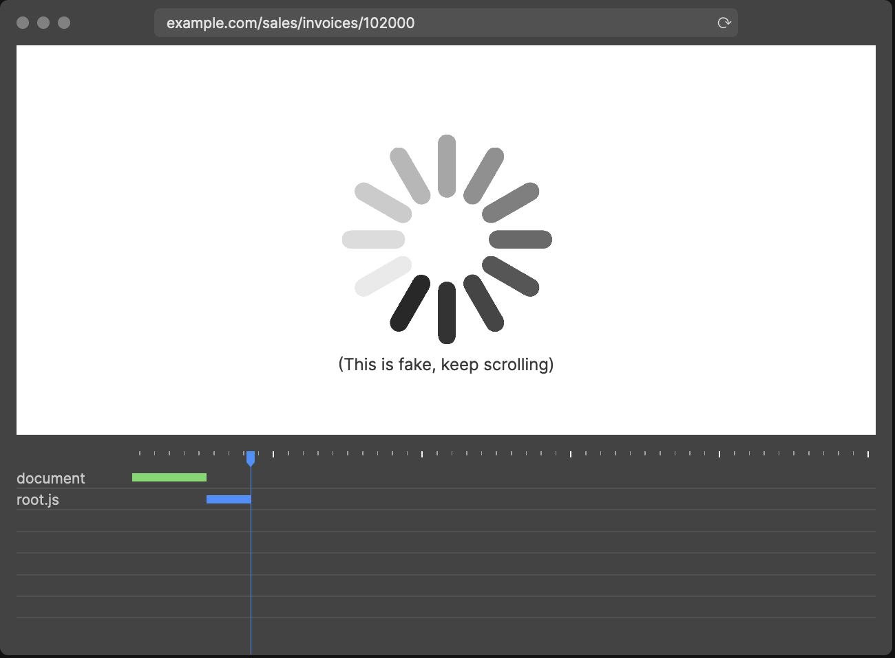
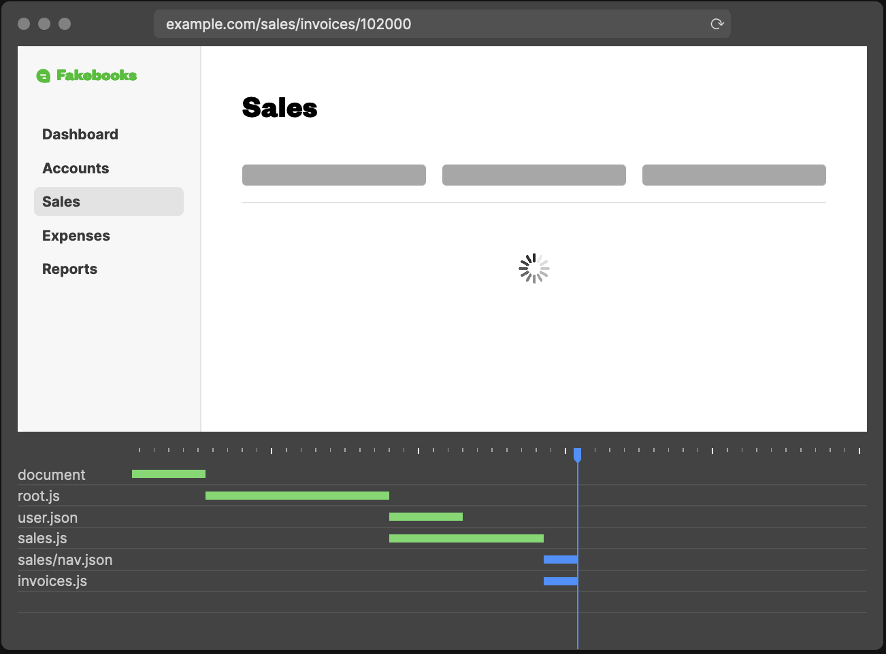
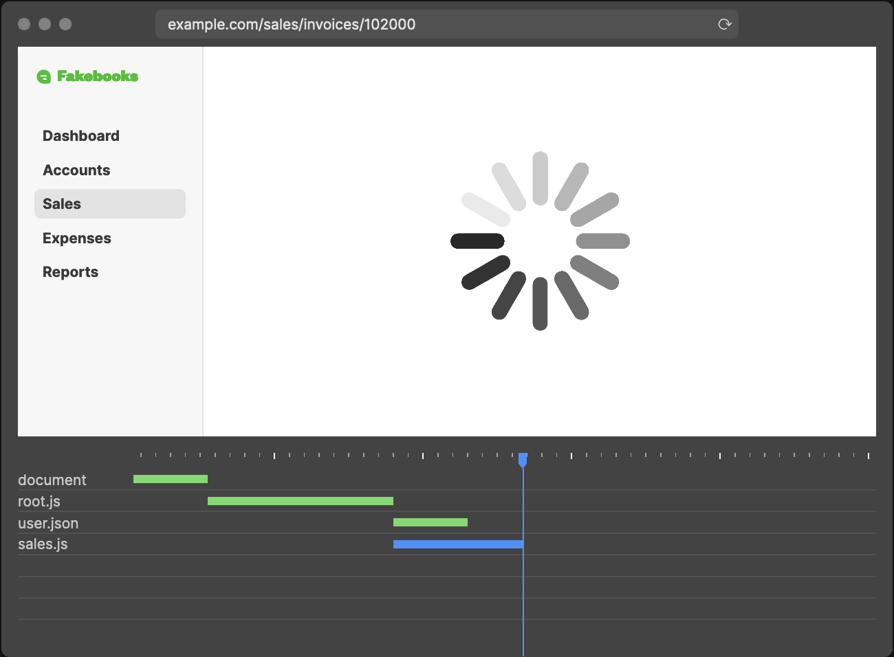
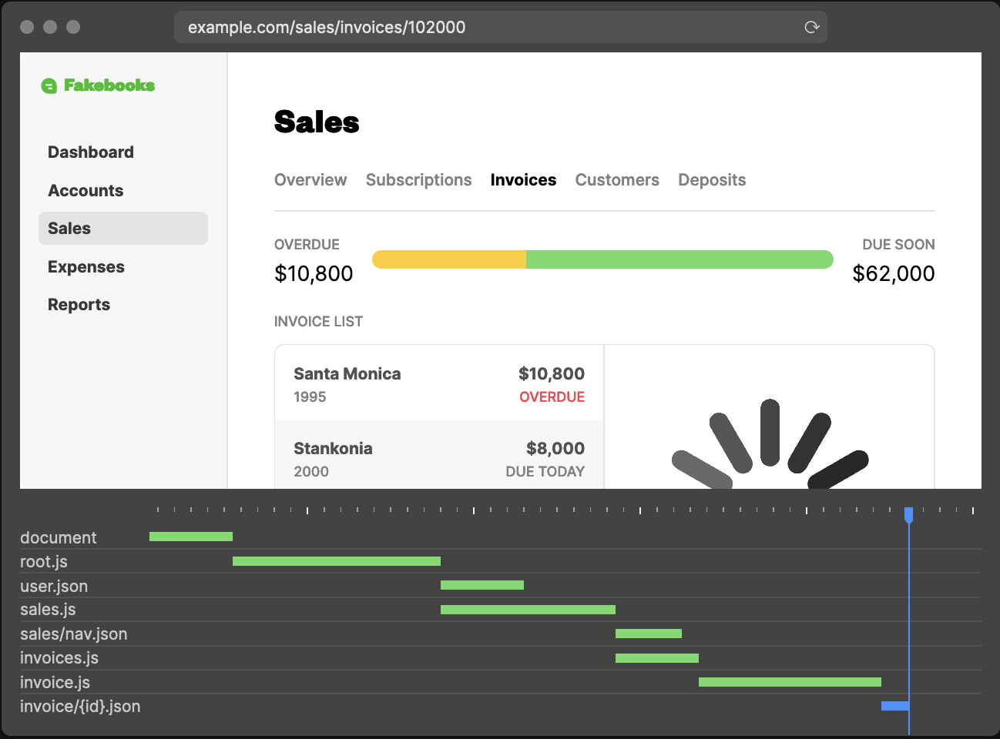
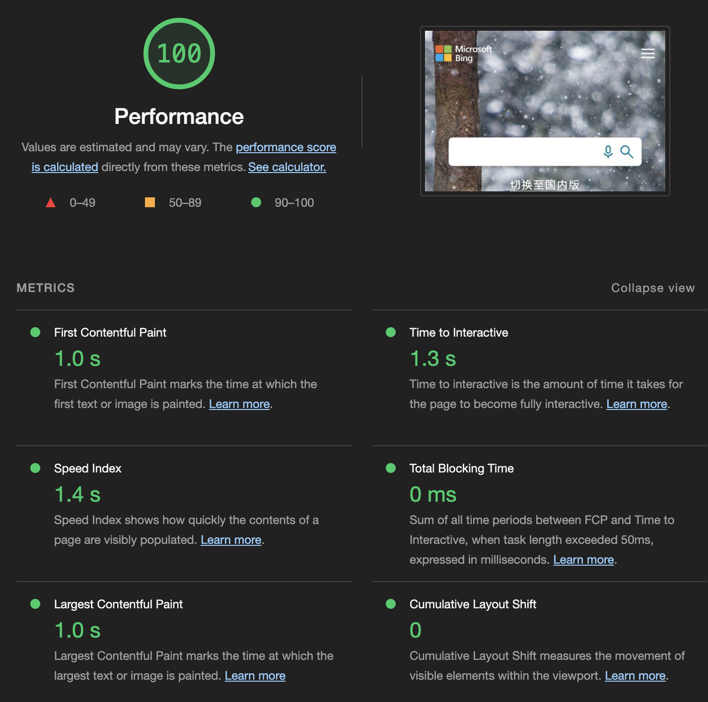

theme: Franziska, 9

# Meta-frameworks review

Frameworks that helps you to build website with great performance without sacrifice the user experience.

* Nextjs
* Astro
* Remix

---

# Why do these meta-frameworks rise?

## Is SPA the answer?

---

# A brief history of the web

---

# SSR VS CSR
| Factor                  | CSR     | SSR   |
|-------------------------|---------|-------|
| SEO                     | Poor    | Good  |
| _User experience_       | Good    | Poor  |
| _Loading performance_   | Poor    | Good  |

---

# Loading performance & User experience: Two side of the double-edged sword

[.column]
CSR network waterfall

[.column]
SSR network waterfall

---

# Spin all the way!

[.column]

[.column]

---

# Metrics of "Launch performance"

[.column]

[.column]
* FCP - First Contentful Paint
* SI - Speed Index
* LCP - Largest Contentful Paint
* TTI - Time to Interactive
* TBT - Total Blocking Time
* CLS - Cummlative Layout Shift

---

# SSG - Static Site Generation

| Factor              | SSR                 | SSG    |
|---------------------|---------------------|--------|
| Loading performance | Fast                | Faster |
| Server pressure     | High                | Low    |
| Scalability         | Relative low        | High   |
| Flexibility         | High                | Low    |
| Infrastructure      | CDN & _Edge server_ | CDN    |

---

# SSG pattern

* Incremental Static Generation
* Island Architecture

---

# When to use SSG

* Content doesn't change frequently
* Content isn't distinct per user

---

# Isomorphic framework & Hydration: Blend the SSR & CSR into one

---

# Issues of early Isomorphic SSR + Hydration

* Hydration has to wait until the whole App tree-node received to start - Slow TTI, also called "uncanny valley".
* Incompatible JS runtime between browsers & nodejs make it not that "isomorphic".
* Lack of infrastructure support drawback the loading performance & increase operation cost.

---

# Modern Hydration Patterns

* Partial Hydration
* Progressive Hydration
* Selective Hydration

---

# Meta-frameworks Comparison

| Factor              | Nextjs        | Astro                     | Remix     |
|---------------------|---------------|---------------------------|-----------|
| Application Pattern | SPA           | MPA                       | SPA       |
| Rendering pattern   | SSG/SSR + CSR | SSR + Island Architecture | SSR + CSR |
| UI framework        | React         | Mixed                     | React     |
| Invasive            | Fair          | Fair                      | High      |

---

# Examples

[meta-frameworks](https://github.com/crusoexia/website-frameworks-in-2022)

---

# References
* [Patterns](https://www.patterns.dev/)
* [The JavaScript Site Generator Review, 2023](https://www.zachleat.com/web/site-generator-review/)
