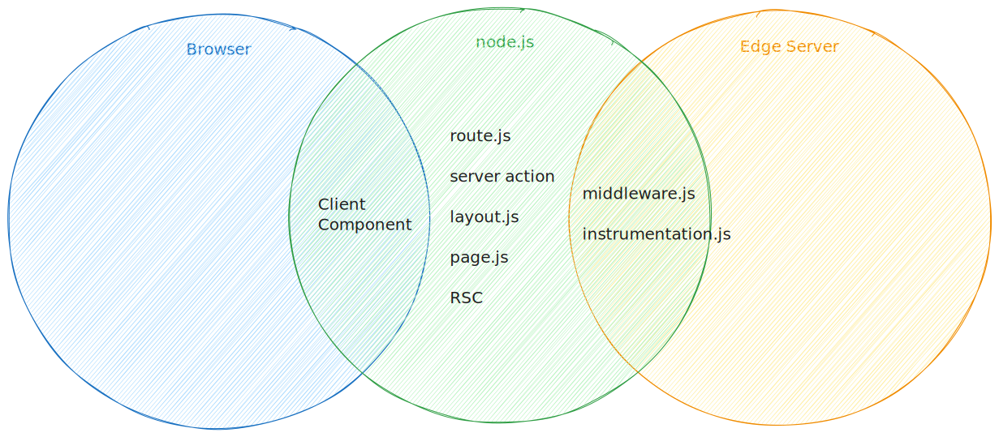
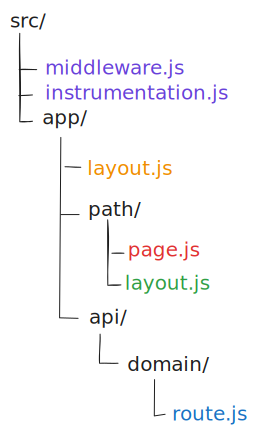
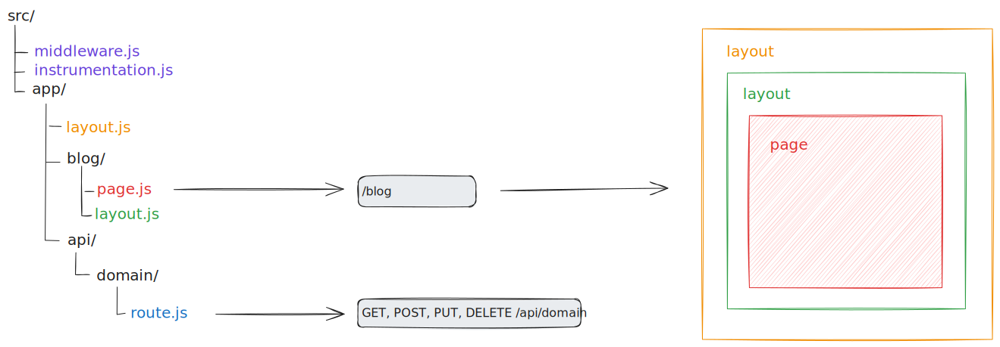
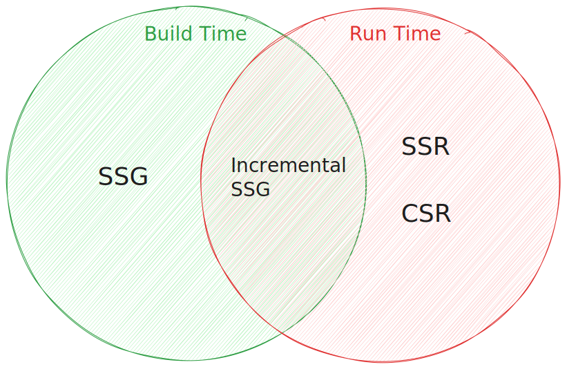
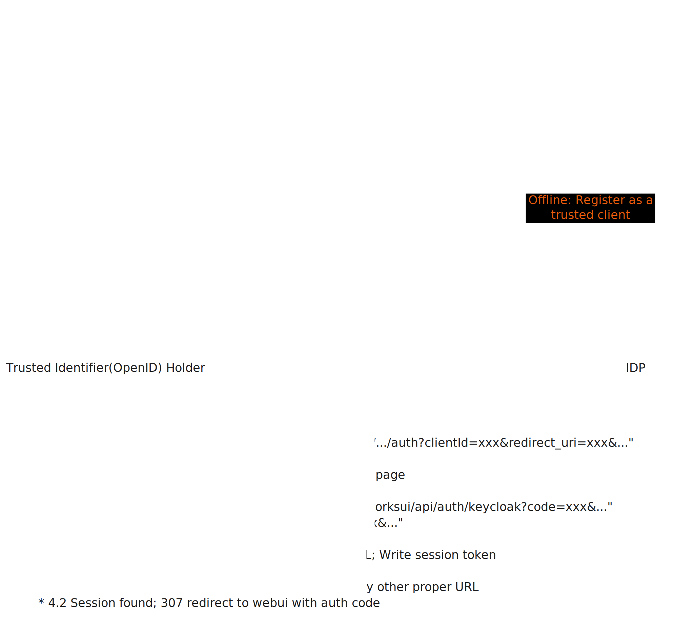
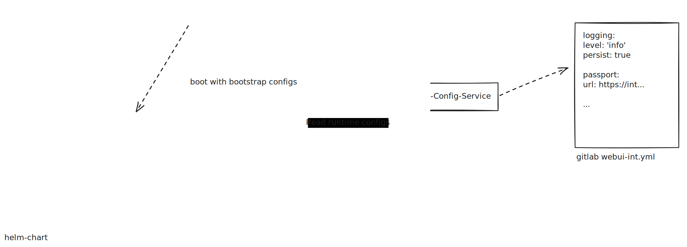

# Next.js in Production

First-Hand Experience

---

## What had been done?

* Passport integration
* Session management
* Routing
* Call internal (SOAP) services
* Tests
* CI and deployment
* Logging and Operation

---

# Impressions

Pretty different than `SPA`

----

**👍 Start fast**

* Setup project fast
* Start development fast
* Setup deployment fast
* A lot of out-of-the-box solutions(like next-auth)

----

**👎 Less flexible**

* Framework intrusive(build, edge runtime etc.)
* Framework limitation(middleware etc.)

----

**👍 Isomorphic**

* Reduce duplication
  * Routing; Authentication
* Reduce client-side JavaScript size
* Reduce client-side complexity
  * API call; State management

----

**👎 Complex**

* More concepts
* More mistakes
* More area need to be take care
* Environment diversity

----

**👍 Rich Render Patterns**

* Fast First-Page-Rendering
* Progressive Hydration

---

# Major Aspects

You should understand to use `next.js` to build full-stack React App.

----

## Next.js Artifacts

* layout.js
* page.js
* RCC & RSC
* route.js
* middleware.js
* instrumentation.js

----

## Runtime



----

## File System Based Routing



----



----

## Deployment model


----

## SSR & SSG

When and where will the rendering happens matter a lot.

----



----

How to contorl the render mode?

```typescript
// page.tsx

//...

export const dynamic = 'force-dynamic';

export const revalidate = 60;

//...
```

See more [route segments](https://nextjs.org/docs/app/api-reference/file-conventions/route-segment-config).

----

## React Server Component

Though the "React Server Component" ends with `.tsx`(or jsx), there is not much similarity
between the "Client Component":

----

**Differences**

* Only run on server just as an API which returns static html or JSON.
* Can call server side APIs directly without `fetch`.
* No `life-cycle`; There is no `mount`, `unmount` or `update`; No state and effects.
* No interaction.

----

**When to Use RSC**

* Use Server Components for static content or data fetching that does not require interactivity.
* Use Client Components for interactive elements that require state, effects, or event handling.

----

## Authentication

[Auth.js](https://authjs.dev/) + keycloak + OAuth(OpenID)

```typescript
NextAuth({
    //...
    providers: [ Keycloak({
      clientId: (await getConfig<string>('keycloakSetting.resource'))?.toUpperCase(),
      clientSecret: await getConfig('keycloakSetting.secret'),
      issuer: path.join(await getConfig('keycloakSetting.authServerUrl'), 'realms/active'),
      checks: [ 'none' ],
    }) ],
    //...
  })
```
<!-- .element: style="font-size: 11pt" -->

----


<!-- .element: style="width: 80%;margin: auto;" -->

----

## Session Management

* jwt
* Local session; Require sticky session
* Remote session storage: database or redis or ...

----

## kubernetes

----

[Networking](https://ea-wiki.sp.k8su1.dev.activenetwork.com/en/arch/containerization#networking)

----

**Application(pod) management API inside k8s**

* readiness/liveness probe
* graceful shutdown

----

**Application Configuration**

* _Environment Variables_ - bootstrap and secrets
* _Central Config Service_ - env specifics
  * `@active/central-config-client`



----

## Logging

* Application log - _Kibana_
  * `@active/logging`(winston)
* Security event log - _Splunk_
  * `@active/security-event-logging`

----

## Unit Test

* There is no difference to test `Client Component`.
* For RSC, it requires `node` test environment.
* `testing-library` is not designed for RSC. Use ReactDom server side render method instead.
* Generally it is easy to test the `Route Handlers` which accept a `Request` and return a `Response`.

---

# Lesson Learned

----

## Singleton

Would blow up your mind.

----

Things(cannot avoid) that would break singleton:

* `child_process`
* SSG and build time workers
* Module resolution differences
  * `cjs` vs `esm` vs `bundler`

[An open issue of next.js](https://github.com/vercel/next.js/issues/65350)

----

Singleton and global state should be avoid.

---

# Conclusion

It feels like developing Asp.net, but more powerful.
