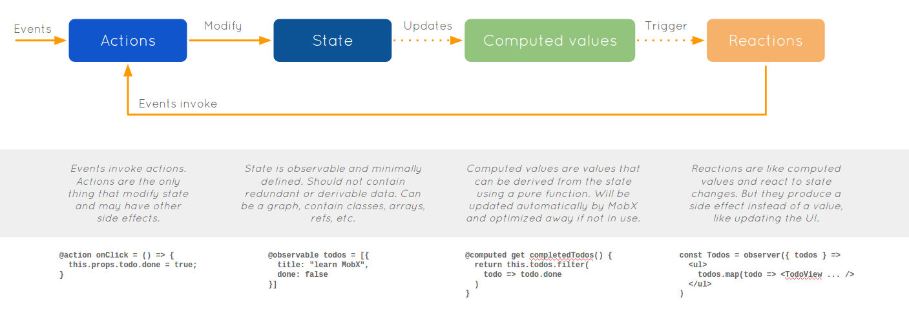

autoscale: true
build-lists: true
slidenumbers: true
theme: Sketchnote, 1

# MobX

## Yet another Flux dialect.

---

# Transparently applying [Functional Reactive Programming](https://en.wikipedia.org/wiki/Functional_reactive_programming)[^1]

[^1]: [Mobx vs Reactive Stream Libraries](https://github.com/mobxjs/mobx/wiki/Mobx-vs-Reactive-Stream-Libraries-\(RxJS,-Bacon,-etc\))

---

---

# Core concepts

* State
* Derivation
* Action

---

# Gists

* @observable
* @computed
* @action
* autorun & reaction

---

# Integrate with React

## [mobx-react](https://github.com/mobxjs/mobx-react)

---

# Organize state

* [Best practice](https://mobx.js.org/best/store.html)
* [mobx-state-tree](https://github.com/mobxjs/mobx-state-tree)

---

# Dump & Stateful

## Provider & inject

---

# Async action

---

# Change state in action, good or bad?

* It's handy when the action only affect single state. :thumbsup:
* It is not very fun when an action need to be awared by multiple states. :thumbsdown:

---

# Pros

* Low boilerplate
* Flexible
* Reactive
* Beautiful code structure by combine state, action, computed in single class
* By define the domain models, the state structure is very clear by reading the code

---

# Cons

* Big footprint for complex actions.
* Poor dev tools.
* Denormalized structure.

---

# Conclution

:thumbsup: Perfect for quick development and simple projects. The way to use it is very direct. It's multiple stores, actions are more respect to Flux compare to Redux's single store and fp, but much simpler than original Flux.
