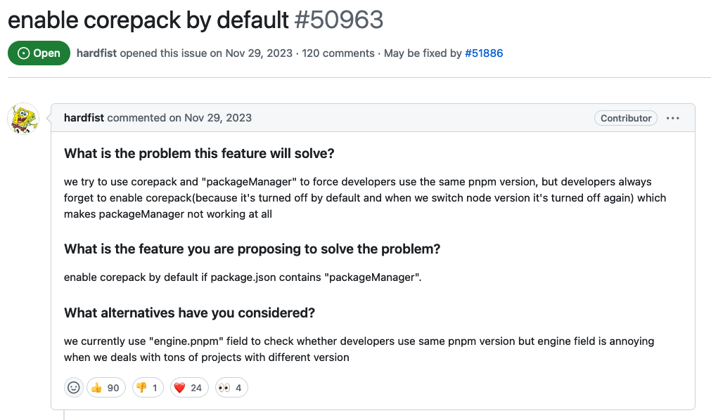

# Discussion

**Remove npm from node.js bundle**


<!-- .element: style="width: 70%;margin: 0 auto;" -->

----

## Result

https://github.com/nodejs/node/pull/51951#issuecomment-1975734926

---

# React Updateds

---

# React 18

----

## `useId`

----

### Usage

> * Generating unique IDs for accessibility attributes
> * Generating IDs for several related elements
> * This hook is available in "Server Component".

----

```tsx
const inputId = useId();
```

Is equal to:
<!-- .element: class="fragment" data-fragment-index="1" -->

```tsx
import { uniqueId } from 'lodash';

const inputId = useMemo(() => uniqueId(), []);
```
<!-- .element: class="fragment" data-fragment-index="1" -->

**Is that true?**
<!-- .element: class="fragment" data-fragment-index="2" -->

----

Consider to use `uniqueId` or global incremental variable for SSR.

* [Demo](http://localhost:3000/samples/useId)
<!-- .element: class="fragment" data-fragment-index="1" -->
* [Explanation](https://react.dev/reference/react/useId#why-is-useid-better-than-an-incrementing-counter)
<!-- .element: class="fragment" data-fragment-index="2" -->

----

> **Caution**: Don't use `useId` to generate persistent purpose ids.

----

## `useTransition`

A React Hook that lets you update the state without blocking the UI.

----

* [Reference](https://react.dev/reference/react/useTransition)
* [Demo](http://localhost:3000/samples/useTransition)

----

## `useDeferredValue`

----

Just like using `lodash.debounce` with timeout `0`:

----

```jsx
const [ keyword, setKeyword ] = useState('');
const [ deferredKeyword, setDeferredKeyword ] = useState(keyword);

const deferChange = useMemo(() => {
  return debounce(0)(setDeferredKeyword);
});

const onKeywordChange = useCallback((e) => {
  setKeyword(e.target.value);
  deferChange(e.target.value);
});

useEffect(() => { dispatch(queryByKeywordAction(deferredKeyword)); }, [ deferredKeyword ]);
```
<!-- .element: style="font-size:14pt" -->


Equals to:
<!-- .element: class="fragment" data-fragment-index="1" -->

```jsx
const [ keyword, setKeyword ] = useState('');
const deferredKeyword = useDeferedValue(keyword);

const onKeywordChange = useCallback((e) => {
  setKeyword(e.target.value);
});

useEffect(() => { dispatch(queryByKeywordAction(deferredKeyword)); }, [ deferredKeyword ]);
```
<!-- .element: class="fragment" style="font-size:14pt" data-fragment-index="1" -->

----

* [Demo](https://github.com/nodejs/node/pull/51951#issuecomment-1975734926)

----

### `useSyncExternalStore`

Provides a flexible way other than `redux`(or something else) to manage global state.

----

* [Demo](https://react.dev/reference/react/useSyncExternalStore)

---

# React Canary

Features that very possible to be available in React 19.

----

## Directives

Provide instructions to bundlers compatible with _React Server Components_.

----

* `'use client'` lets you mark what code runs on the client.
* `'use server'` marks server-side functions that can be called from client-side code.

----

['use server' Demo](https://localhost:3000/samples/directives)

----

## Actions
Mechanism and a set of APIs make state mutation management much easier.

----

* `useOptimistic` - [Demo](https://localhost:3000/samples/actions)
* `useFormStatus` - [Reference](https://react.dev/reference/react-dom/hooks/useFormStatus)
* `useFormState` - [Reference](https://react.dev/reference/react-dom/hooks/useFormState)

----

## Other notable updates

* Asset Loading
* React Compiler
