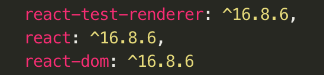
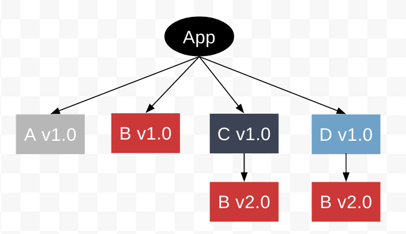

autoscale: true
build-lists: true
theme: sketchnote, 5

# Rethink In Monorepo

---

# When you install React or Babel...

## How do you know which versions' companion packages should be installed?

---

# The answer is you don't even think about it.

---

# The React and it's coupling package follow a convension that people easy to follow - All of them have the same version

---

---

# Why it's important to have a fixed version for monorepo packages?

---

# To have packages that just works with each other.

* They can **easily** know there dependency tree is hearthy when they were using same version for a series packages.
* They can **easily** know they should upgrade their libs when they were using different versions for a series packages. 
* They don't need to swim in the CHANGELOGS to make sure each companion packages have the correct version.

---

# Npm can handle the different version of the same package

## But the users' bundle size would be uncontrolled.[^1]

[^1]: [Understanding npm dependency resolution](https://medium.com/learnwithrahul/understanding-npm-dependency-resolution-84a24180901b)

---

# Some practice that I found useful for monorepo.

* Hoist common dependencies
* Hoist tools and building scripts
