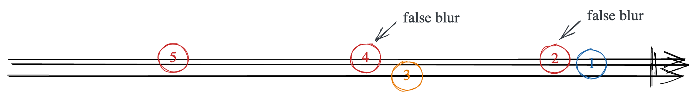

# Detect combobox blur and focus

## We want to call the `onBlur` when the combobox really blured - The focus in neither on combobox nor on the listbox.

---

# False blur scenarioes


---

# The flag's solution

```javascript
const ComboBox = () => {
  const listboxClickFlag = useRef();
  const listboxFocusFlag = useRef();

  const handleListboxClick = useCallback(() => {
    listboxClickFlag.current = true;
    setTimeout(() => {
      listboxClickFlag.current = false;
    }, 0);
    // ...
  }, []);

  const handleListboxFocus = useCallback(() => {
    listboxFocusFlag.current = true;
    setTimeout(() => {
      listboxFocusFlag.current = false;
    }, 0);
    //...
  }, []);

  const handleComboBoxBlur = useCallback((e) => {
    const { onBlur } = this.props;
    if (!listboxClickFlag.current && !listboxFocusFlag.current) {
      onBlur?.(e);
    }
  }, []);

  //...
}
```

---

# Rxjs' solution

---

# Present in event stream


---

# Analyze the diagram



---

# Use rxjx to manipulate the async event streams


---

# The final code

```typescript
const getComponentBlurObservable = (params: { comboBox: HTMLElement; listBox: HTMLElement; }) => {
  const { comboBox, listBox } = params;
  const comboBoxBlur$ = fromEvent<FocusEvent>(comboBox, 'blur').pipe(map(e => [ COMBOBOX_BLUR, e ]));
  const listBoxClick$ = fromEvent<MouseEvent>(listBox, 'click').pipe(map(e => [ LISTBOX_CLICK, e ]));
  const listBoxFocus$ = fromEvent<FocusEvent>(listBox, 'focus', { capture: true }).pipe(map(e => [ LISTBOX_FOCUS, e ]));

  return comboBoxBlur$
    .pipe(mergeWith(listBoxClick$, listBoxFocus$))
    .pipe(debounceTime(0))
    .pipe(filter(compose(eq(COMBOBOX_BLUR), first)))
    .pipe(map(last));
}
```
