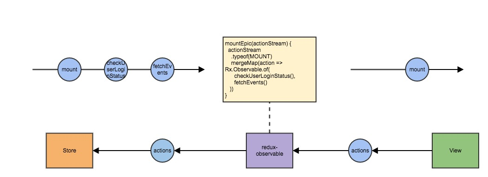

autoscale: true
build-lists: true

# rxjs - Reactive Programming

---

# What is reactive programming?

---

> In computing, reactive programming is a declarative programming paradigm concerned with data streams and the propagation of change.
> --[Wikipedia](https://en.wikipedia.org/wiki/Reactive_programming)

---

# rxjs 6

* More functional programming style.
* Simpler and cleaner package structures.
* Bad documentation.

---

# [Marble diagram](http://rxmarbles.com/)

---

# Exercise - Morse code

[wiki](https://zh.wikipedia.org/wiki/%E6%91%A9%E5%B0%94%E6%96%AF%E7%94%B5%E7%A0%81)
[repo](https://github.com/crusoexia/morse-code)

---

# Reactive with redux - redux-observable

---

---

# Recommand resources

* [Wikipedia](https://en.wikipedia.org/wiki/Reactive_programming)
* [The introduction to Reactive Programming you've been missing](https://gist.github.com/staltz/868e7e9bc2a7b8c1f754)
* [Rxjs ultimate](https://legacy.gitbook.com/book/chrisnoring/rxjs-5-ultimate/details)
* [Learn RxJS](https://www.learnrxjs.io/)
* [RxJS Marbles](http://rxmarbles.com/)
