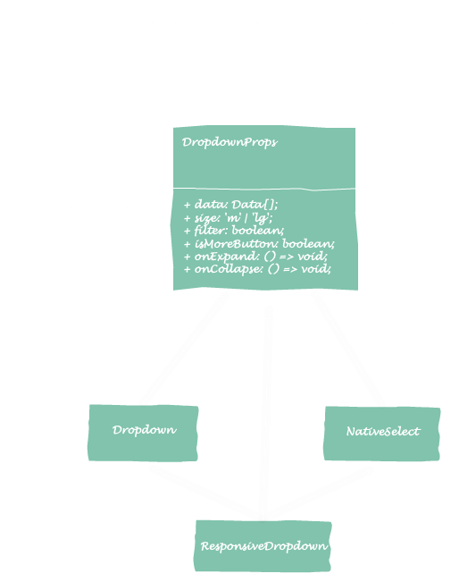
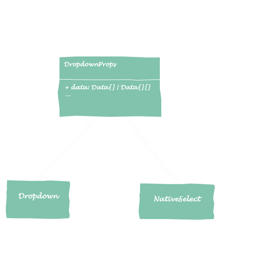
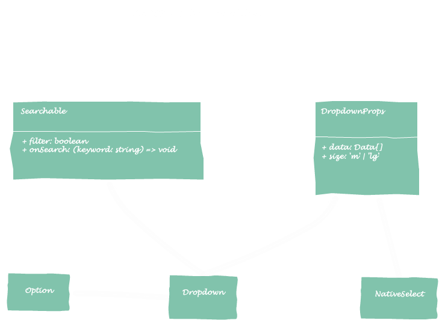

build-lists: true
theme: Scherzkeks, 1

# ISP

---

> Don't force client depends on the methods they don't use.

* Use cohesive interfaces to separate the not cohesive **fat** interface.

---

# Dropdown

---

Client A: I want a searchable styleful dropdown.


```html
<Dropdown
  data={data}
  filter
  isMoreButton={false}
  onExpand={handleExpand}
  onCollapse={handleCollapse}
  maxHeight={100}/>
```

---

Client B: I want the dropdown use mobiles' native selector.

```html
<NativeSelect
  data={data}
  size="m"/>
```

---

Client C, D, E...: I want a responsive dropdown which works equally efficient on different size devices.

---



---

The client will apply reaction force to the interface.

---



---

Split the client is split interface.

---



---

Fat interface will cause clients coupled with each other. Group the clients by type, define cohesive interfaces for each type.
