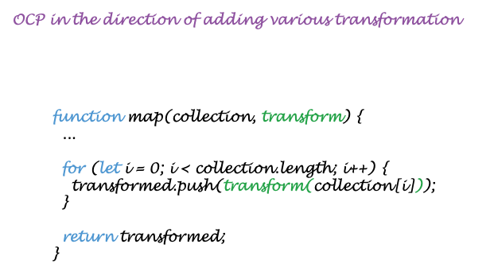

build-lists: true
theme: Business Class, 1

# Open-Close Principle

---

> A software artifact should be open for extension but close for modification.

---

# The fundamental reason why we study software architecture.

The behavior of a software artifact ought to be extendible, without having to modify that artifact. 

---

# What's wrong for violating the OCP?

---

---

# OCP in OOP

---

---

# OCP in FP

---

---

# A live case - Dropdown component

---

---

---

---

# OCP come with a cost

---

## Not all parts can be open for extension, design your software artifacts wisely - Open extension for the most possible/frequently *Change Directions*.
