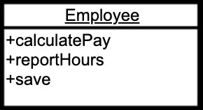
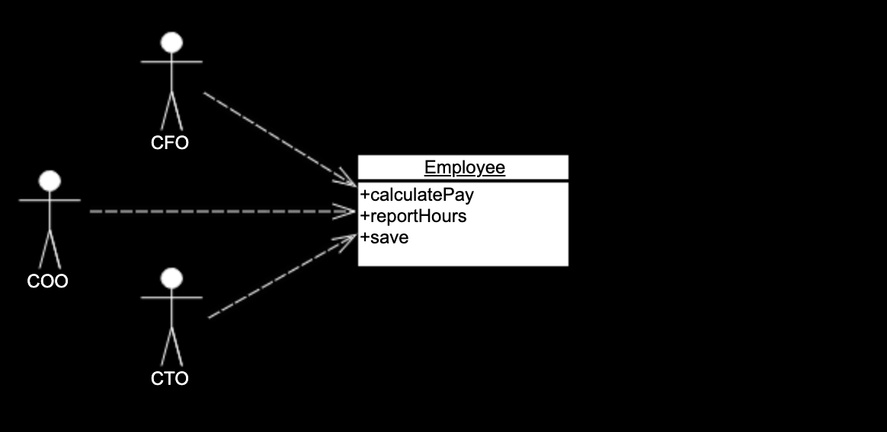
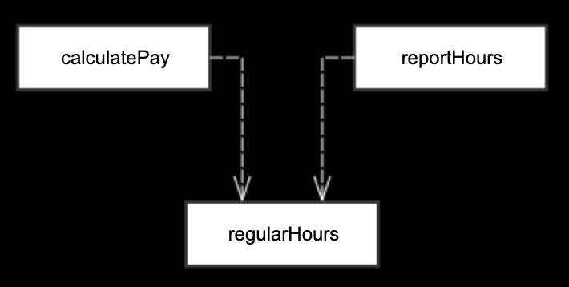
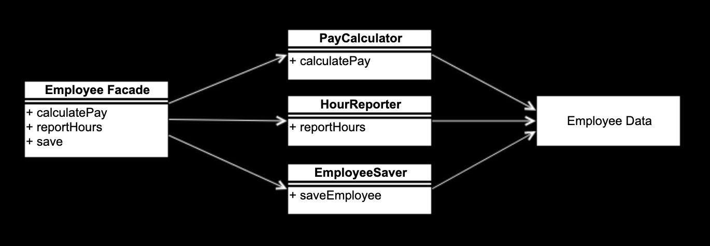

autoscale: true
build-lists: true
theme: Next, 8

# Single Responsibility Principle

---

* FUNCTIONS SHOULD DO ONE THING. THEY SHOULD DO IT WELL. THEY SHOULD DO IT ONLY.[^1]
* A class or module should have one, and only one, *reason* to change.[^2]
* A module should be responsible to one, and only one, actor.[^3]

[^1]: <<Clean Code>>

[^2]: <<Agile Software Development>>

[^3]: <<Clean Architecture>>

---

> FUNCTIONS SHOULD DO ONE THING. THEY SHOULD DO IT WELL. THEY SHOULD DO IT ONLY.

---

# What is "one thing"?

---

```javascript
async function findInviteInfo(agencyInviteGuid) {
  try {
    const agencyInvite = await Invite.findAgencyInviteByGuidAsync(agencyInviteGuid);
    agencyInvite.isInviteValid = agencyInvite.status !== 'ACCEPTED'
      && agencyInvite.status !== 'REJECTED' && agencyInvite.status !== 'CANCELLED';
    if (agencyInvite.isInviteValid) {
      const receiver = await Invite.findPersonByIdAsync(agencyInvite.personId);
      agencyInvite.firstName = receiver.firstName;
      agencyInvite.lastName = receiver.lastName;
      agencyInvite.enterprisePersonId = receiver.enterprisePersonId;
      agencyInvite.accountExist = await Invite.doesUsernameExistAsync(agencyInvite.emailAddress);
    }
    const agency = await Invite.findAgencyByIdAsync(agencyInvite.agencyId);
    agencyInvite.agencyName = agency.name;
    const sender = await Invite.findPersonByIdAsync(agencyInvite.senderId);
    agencyInvite.senderFirstName = sender.firstName;
    agencyInvite.senderLastName = sender.lastName;
    if (sender.primaryElectronicAddress && sender.primaryElectronicAddress.address) {
      agencyInvite.senderEmail = sender.primaryElectronicAddress.address;
    }
    if (!agencyInvite.senderEmail) {
      const accountService = await soapClient(userWsdl);
      const [
        {
          findAccountByEnterprisePersonIdResult: {
            account: { userName: senderEmail },
          },
        },
      ] = await accountService.findAccountByEnterprisePersonIdNewAsync({
        context: inviteQueryContext,
        findAccountByEnterprisePersonIdRequest: {
          enterprisePersonId: sender.enterprisePersonId,
        },
      });
      agencyInvite.senderEmail = senderEmail;
    }
    agencyInvite.sender = {
      senderId: agencyInvite.senderId,
      senderEmail: agencyInvite.senderEmail,
      senderFirstName: agencyInvite.senderFirstName,
      senderLastName: agencyInvite.senderLastName,
    };
    delete agencyInvite.senderId;
    delete agencyInvite.senderEmail;
    delete agencyInvite.senderFirstName;
    delete agencyInvite.senderLastName;
    delete agencyInvite.createdBy;
    delete agencyInvite.createdDate;
    delete agencyInvite.modifiedBy;
    delete agencyInvite.modifiedDate;
    delete agencyInvite.createdBy;
    delete agencyInvite.inviteDate;
    return agencyInvite;
  } catch (e) {
    return { emailAddress: null };
  }
}
```

---

```typescript
function extract(config: Config, fa: FileAccessor, args?: Args = {}) {
  const outDir = args.out ? path.resolve(args.out) : path.join(paths.appRoot, config.localePath, DEFAULT_OUT);
  if (args.locale) {
    extractSpecified(config, fa, args.locale, outDir);
  } else {
    extractAll(config, fa, outDir);
  }
}
```

---

```typescript
function withLogParagraph(logContent: (...args: any[]) => void) {
  return (...args: any[]) => {
    log('');
    logContent(...args);
    log('');
  };
}
```

---

# The "To paragraph"

---

# How to define "one thing"?

* One level of abstraction below the stated name of function
* Cannot extract another function from it with the name which is not merely a restatement of the implementation.
* The "7 line" rule.

---

# Refactored `extract`

```typescript
function getOutDir(out: string, localePath: string) {
  return args.out ? path.resolve(args.out) : path.join(paths.appRoot, config.localePath, DEFAULT_OUT)
}

function extract(config: Config, fa: FileAccessor, args?: Args = {}) {
  const outDir = getOutDir(args.out, config.localePath);
  if (args.locale) {
    extractSpecified(config, fa, args.locale, outDir);
  } else {
    extractAll(config, fa, outDir);
  }
}
```

---

> A class or module should have one, and only one, *reason* to change.

---

*@active/react-ui/Form/FormContext.ts*

```typescript
import { FieldInputProps } from 'formik';
// other imports...

export type Alignment = 'horizontal' | 'vertical';
export const HORIZONTAL = 'horizontal';
export const VERTICAL = 'vertical';

export interface Form<Values> {
  alignment?: Alignment;
  values?: FormValues;
  errors?: FormErrors<Values>;
  isValid?: boolean;
  // other properties of Form
}

export interface FormContext<Values = FormValues> {
  form?: Form<Values>;
}

const Context = createContext<FormContext<FormValues>>({
  form: {
    alignment: VERTICAL,
    // ...
  },
});

export const { Provider: FormProvider } = Context;
export const { Consumer: FormConsumer } = Context;
```

---

# Why are we afraid of "multiple reason to change"?

* It cause responsibles coupled with each other.
* It forces user depends on the stuffs they don't need.
* Hard to find the desired stuff.
* It causes duplication.
* Hard to reuse.

---

# How to identify different responsibilities?

* By name.
* The reason to change.
* The changes direction.
* By actors.

---

> A module should be responsible to one, and only one, actor.

---



---



---



---


