autoscale: true
build-lists: true
theme: Merriweather, 8

# The Path Of Software Desgin: A Case Sharing
## From Requirement To Delivery

---

# Get the requirement

---

# Analyze the requirement - Clarify the goals

1. Clarify *What problem should the system solve?*
1. Clarify *Who is the User?*
2. Clarify *How would the User use the System?*
3. Non-functional requirements?
5. Pickup tech stack

---

# Draft Mind Map

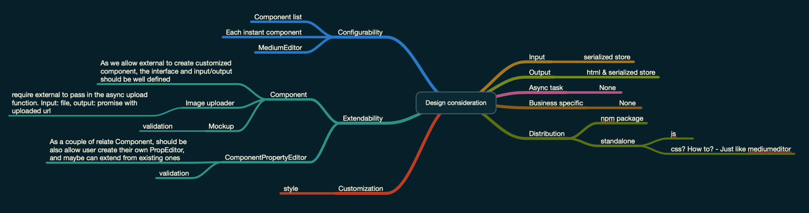

---

# Abstraction design

1. Draw System behaviors; inputs; outputs.
2. Split the Big picture into small individual, self-contained parts.
3. Draw diagrams to present the system.

---

# Initial Abstraction design

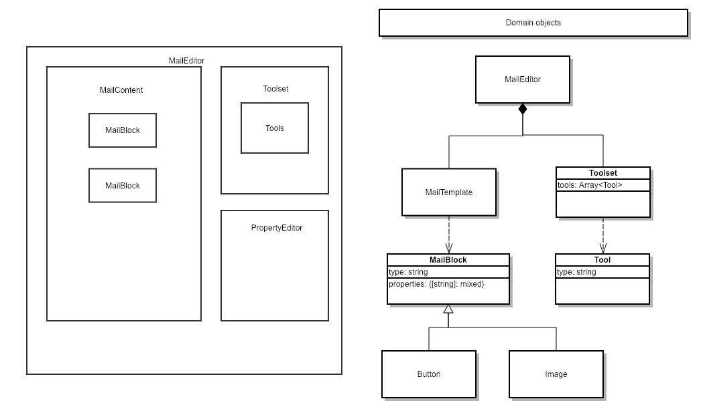

---

# Detail Design

1. Design API from user's perspective.
2. Analyze the *necessary* information of each API(ISP).

---

# Evolve the details in short interation circles

To avoid over-engineering.

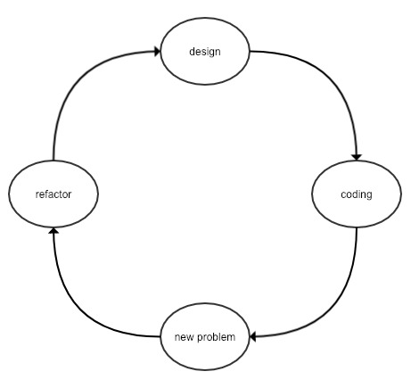

---

# A case sharing - Create Tool

---

# The initial problem

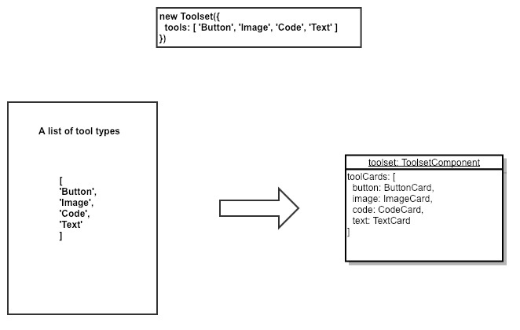

---

# The inital design

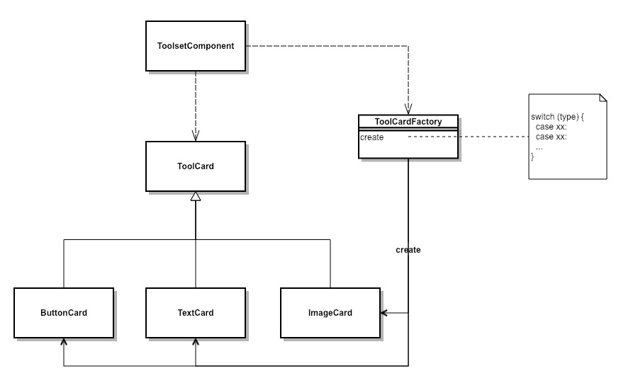

---

# A new problem

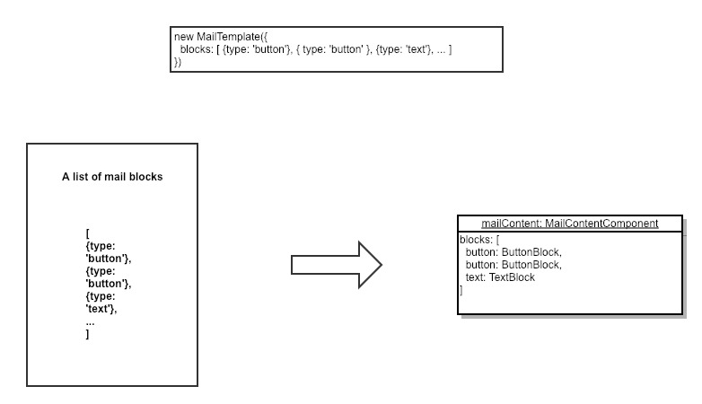

---

# Refactor

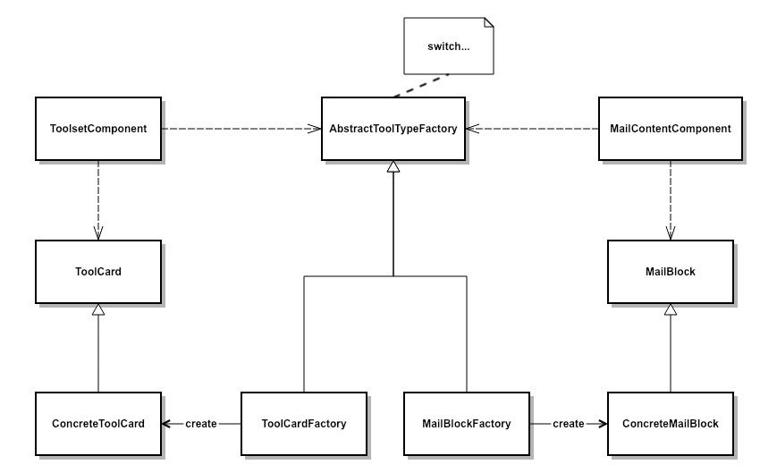

---

# Revisit the domain design

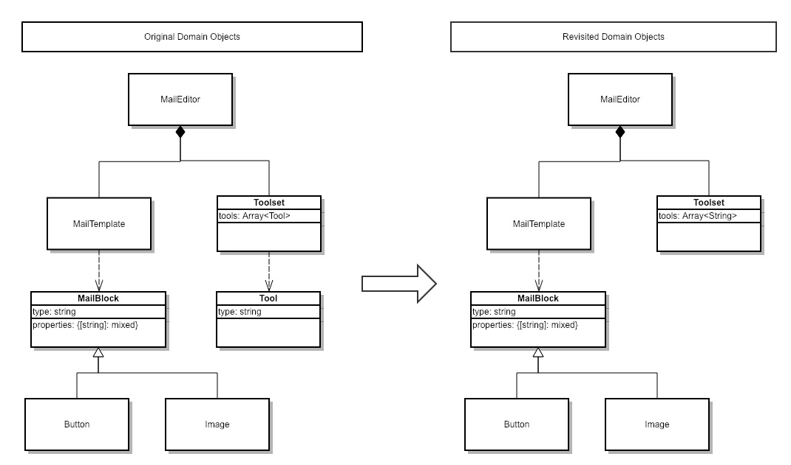

---

# Turn over - a problem that unexpected

One of the user want to add customized section in the Text-tool.

---

# Turn over - initial thought of the new problem

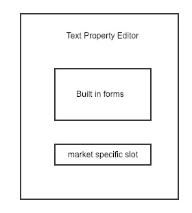

But what if another user want to add the customized section on the top of the form?

---

# Losing-Hair.jpg

---

# Turn over - After recall the critical *Design targets*

* Highly Configurable
* Highly Extendable

---

# New requirements driven out new design decision

* Give user ability to create new tools and override existing tools.
* User can use other UI framework to build tools.

---

# Rethinking about the domain base on the new decision

Found that the **Tool** is still an important concept in our system, and thinking in this way further, found:

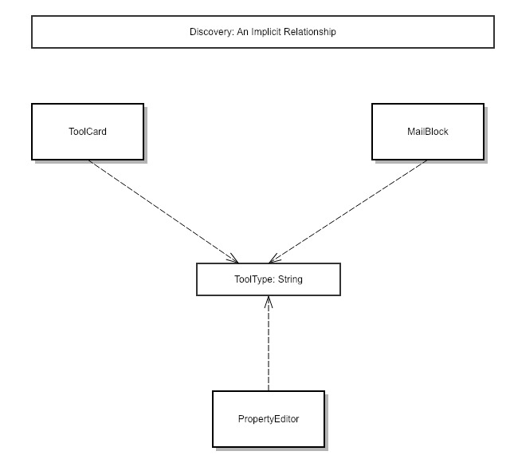

---

# Solution - The Tool domain object

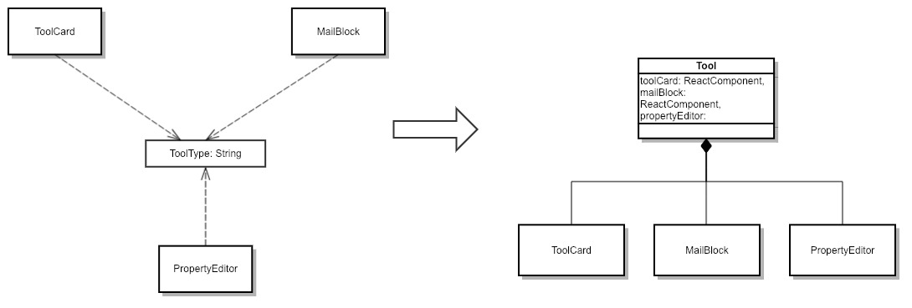

---

# Final design

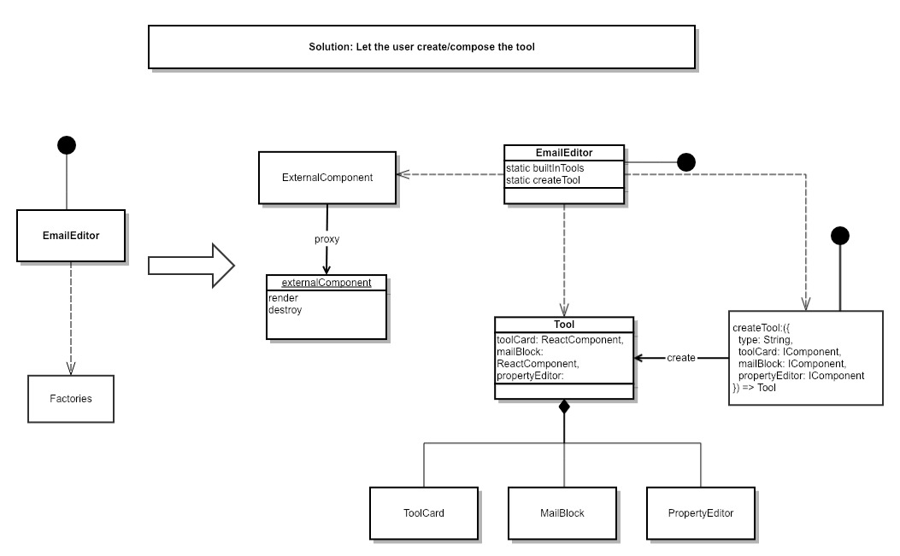

---

# Tips 1: How to make difficult design decision?

* It's just a trade-off balance

---

# Tips 2: How to convince UX to change/give up design?

* Analyze the UX from user perspective.
* Convince UX by economics, datas and facts.

---

# Flow chat of solve difficult problems.

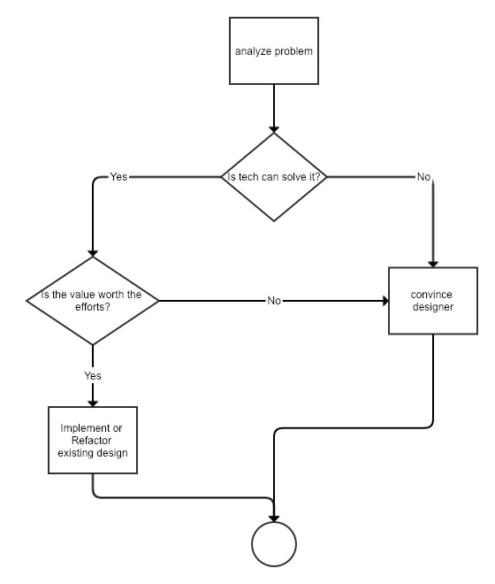
