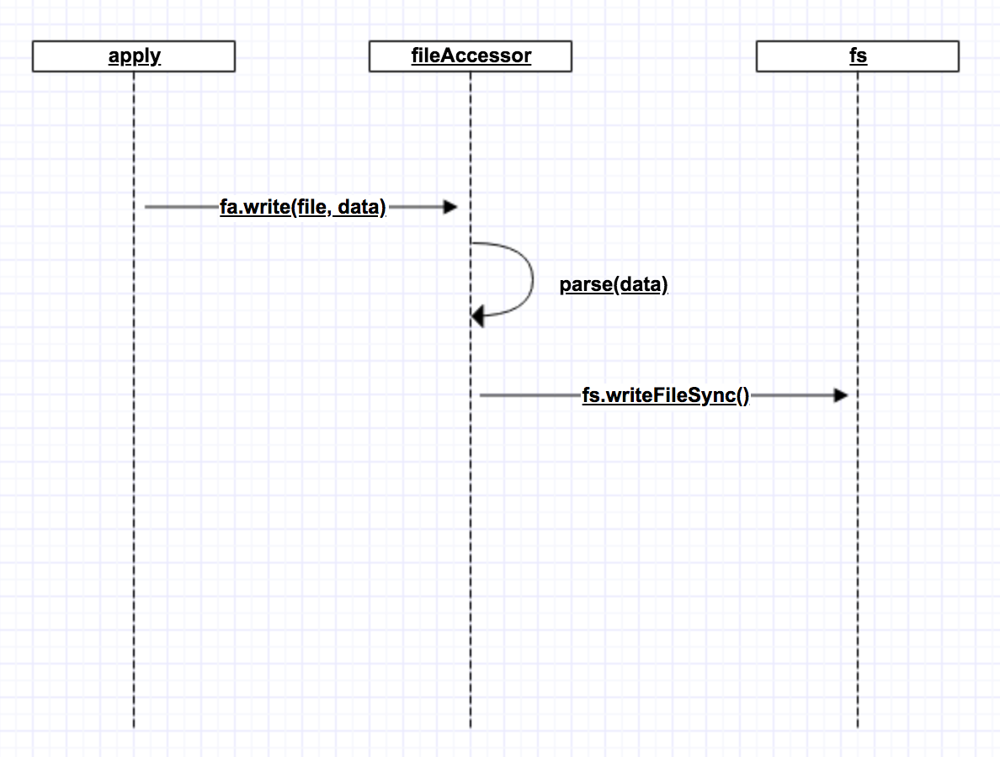

autoscale: true
build-lists: true
theme: Titillium, 1

# The Spirit Of Refactor

---

You was assigned a task and you thought it is easy, you open your editor and try to find out the place to start your work. The code looks wired but you still believe you can handle it. You jostle some codes into the lines, refresh the page and thought you can go home earlier. The page displays after a few seconds, your code works. However, when you click on some elements, something far away in the other side are broken. You switch back to the code, try to find out the reason, one hour later, you found you are fall into a hole.

---

# What will you do when you found the code going to modify is a shit?

---

# Option one

"The code is a shit, but my task is really simple, I don't want to risk myself by involve any additional efforts."

* You stir the shit, carefully create you own upon it, leave it even harder to understand.
* => The shit become bigger than bigger until no one brave enough to touch it.

---

# Option two

"It is ridiculous! I will rewrite it!"

* Your arrogant force you to recreate the whole stuff from scratch.
* => You might success, with countless over time. The scope is tons' time than the original estimation, some functions are missed, QA is unhappy, no one is.

---

# Then what should we do?

* Don't let your code becomes to shit. When you smell the smell, clean up the code[^1], don't be beaten by your lazyness - That's the spirit of **Refactor**.

[^1]: Most of the cases it just requires spliting big function into smaller ones, sometimes it requires to create a new level of abstruction or new package structure etc.

---

# A live case - i18nassist

---

# The problem

## What we want to do:
Change the `write` strategy of `FileAccessor`.

## The issue we have to face:
We need to repeat the strategy in every concrete implementation.

---

# Refactor to new design

The problem force us think: Why we create multiple `FileAccessor` at the first place, what issue it wants to resolve?

---

# Postscript - When should I refactor the code?

* A simple signal is when you found you have to repeat a piece of code in more than one place.
* When you feel something is not right, fix it!
