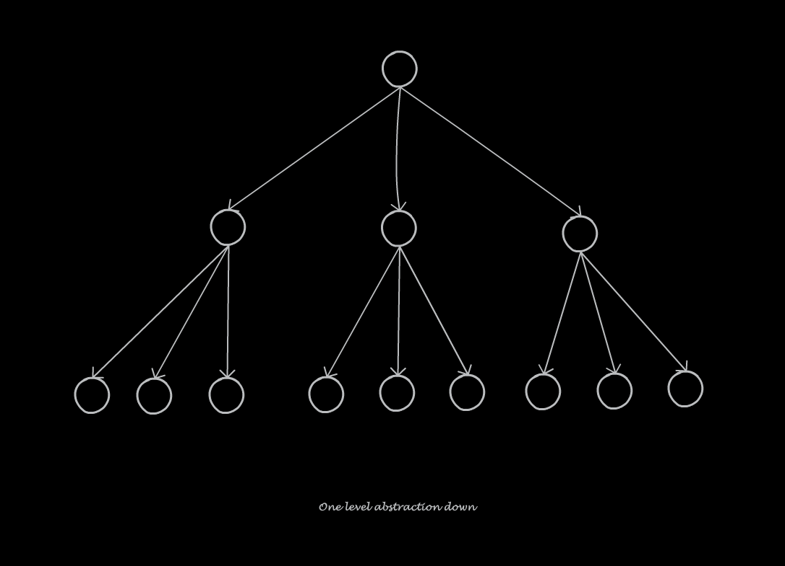
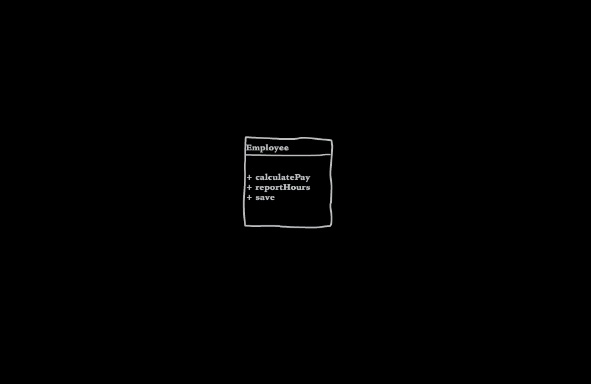
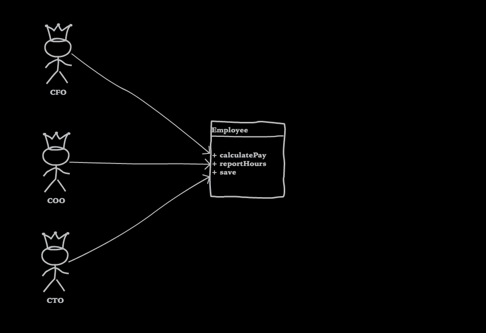
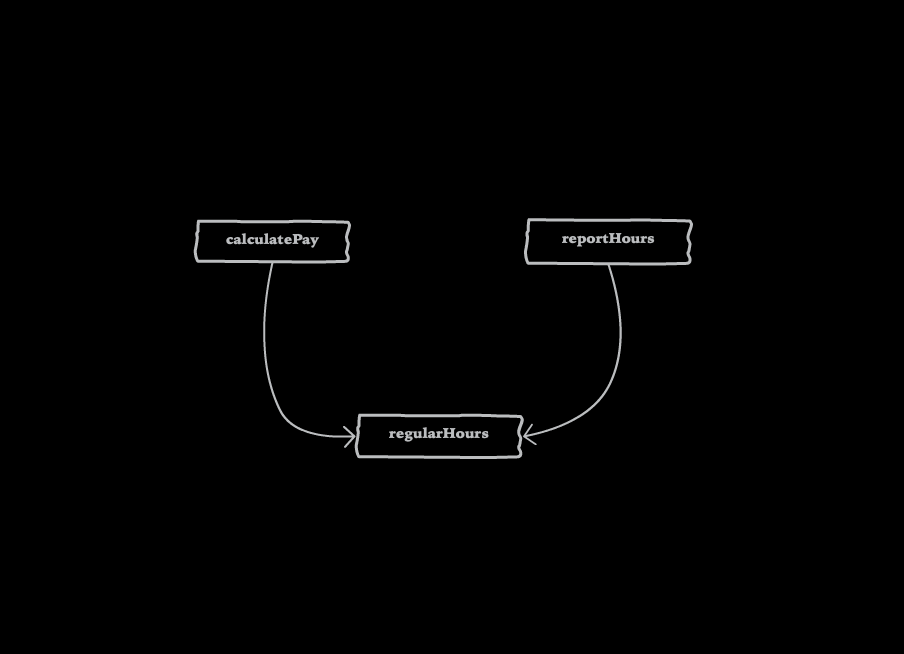
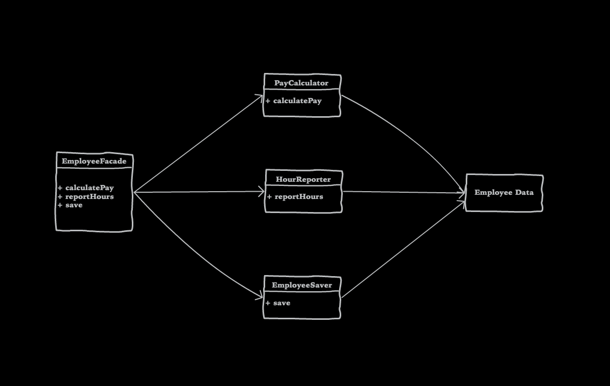

autoscale: true
build-lists: true
theme: Next, 8

# The Ultimate Principle Of Coding

* Single Responsibility Principle
* Highly cohesive, loosely coupled
* Orthogonality

---

# The formal definitions

* Functions should do one thing. They should do it well. They should do it only.[^1]
* A class or module should have one, and only one, *reason* to change.[^2]
* A module should be responsible to one, and only one, actor.[^3]

[^1]: <<Clean Code>>

[^2]: <<Agile Software Development - Principle, Pattern, and Practice>>

[^3]: <<Clean Architecture>>

---

> Functions should do one thing. They should do it well. They should do it only.

---

# What is "one thing"?

---

[.column]

```javascript
async function findInviteInfo(agencyInviteGuid) {
  try {
    const agencyInvite = await Invite
      .findAgencyInviteByGuidAsync(agencyInviteGuid);
    agencyInvite.isInviteValid = agencyInvite.status !== 'ACCEPTED'
      && agencyInvite.status !== 'REJECTED' 
      && agencyInvite.status !== 'CANCELLED';
    if (agencyInvite.isInviteValid) {
      const receiver = await Invite.findPersonByIdAsync(agencyInvite.personId);
      agencyInvite.firstName = receiver.firstName;
      agencyInvite.lastName = receiver.lastName;
      agencyInvite.enterprisePersonId = receiver.enterprisePersonId;
      agencyInvite.accountExist = await Invite
        .doesUsernameExistAsync(agencyInvite.emailAddress);
    }
    const agency = await Invite.findAgencyByIdAsync(agencyInvite.agencyId);
    agencyInvite.agencyName = agency.name;
    const sender = await Invite.findPersonByIdAsync(agencyInvite.senderId);
    agencyInvite.senderFirstName = sender.firstName;
    agencyInvite.senderLastName = sender.lastName;
    if (sender.primaryElectronicAddress 
      && sender.primaryElectronicAddress.address) {
      agencyInvite.senderEmail = sender.primaryElectronicAddress.address;
    }
    if (!agencyInvite.senderEmail) {
      const accountService = await soapClient(userWsdl);
      const [
        {
          findAccountByEnterprisePersonIdResult: {
            account: { userName: senderEmail },
          },
        },
```

[.column]

```javascript
      ] = await accountService.findAccountByEnterprisePersonIdNewAsync({
        context: inviteQueryContext,
        findAccountByEnterprisePersonIdRequest: {
          enterprisePersonId: sender.enterprisePersonId,
        },
      });
      agencyInvite.senderEmail = senderEmail;
    }
    agencyInvite.sender = {
      senderId: agencyInvite.senderId,
      senderEmail: agencyInvite.senderEmail,
      senderFirstName: agencyInvite.senderFirstName,
      senderLastName: agencyInvite.senderLastName,
    };
    delete agencyInvite.senderId;
    delete agencyInvite.senderEmail;
    delete agencyInvite.senderFirstName;
    delete agencyInvite.senderLastName;
    delete agencyInvite.createdBy;
    delete agencyInvite.createdDate;
    delete agencyInvite.modifiedBy;
    delete agencyInvite.modifiedDate;
    delete agencyInvite.createdBy;
    delete agencyInvite.inviteDate;
    return agencyInvite;
  } catch (e) {
    return { emailAddress: null };
  }
}
```

---

```typescript
function extract(config: Config, fa: FileAccessor, args?: Args = {}) {
  const outDir = args.out ? path.resolve(args.out) : path.join(paths.appRoot, config.localePath, DEFAULT_OUT);
  if (args.locale) {
    extractSpecified(config, fa, args.locale, outDir);
  } else {
    extractAll(config, fa, outDir);
  }
}
```

---

```typescript
function logParagraph(content) {
  log('');
  log(content);
  log('');
}
```

---

# The "To paragraph"

---

# How to define "one thing"?

* The "x line" rule.
* One level of abstraction below the stated name of function.
* Cannot extract another function from it with the name which is not merely a restatement of the implementation.

---



---

# Refactored `extract`

```typescript
function getOutDir(out: string, localePath: string) {
  return args.out ? path.resolve(args.out) : path.join(paths.appRoot, config.localePath, DEFAULT_OUT)
}

function hadSpecifiedLocale(cliArgs: Args) {
  return !!args.locale;
}

function extract(config: Config, fa: FileAccessor, args?: Args = {}) {
  const outDir = getOutDir(args.out, config.localePath);
  if (hadSpecifiedLocale(args)) {
    extractSpecified(config, fa, args.locale, outDir);
  } else {
    extractAll(config, fa, outDir);
  }
}
```

---

# Now we know what "one thing" is for functions. Does it matter?

* It is easy for understanding.
* The "Broken window" effect.
* It is "accidentally" easy for reuse.
* It isolates the possible changes.

---

> A class or module should have one, and only one, *reason* to change.

---

```javascript
class Event {
  static async isThirdPartyOrganization(enterprisePersonId, email, agency) {
    // ...
  }

  static async findEvents(agency) {
    // ...
  }
}
```

---

*@active/react-ui/Form/FormContext.ts*

```typescript
import { FieldInputProps } from 'formik';
// other imports...

export type Alignment = 'horizontal' | 'vertical';
export const HORIZONTAL = 'horizontal';
export const VERTICAL = 'vertical';

export interface FormContext<Values = FormValues> {
  form?: {
    alignment?: Alignment;
    values?: FormValues;
    errors?: FormErrors<Values>;
    isValid?: boolean;
    // ...
  };
}

const Context = createContext<FormContext<FormValues>>({
  form: {
    alignment: VERTICAL,
    // ...
  },
});

export const { Provider: FormProvider } = Context;
export const { Consumer: FormConsumer } = Context;
```

---

# How to identify different responsibilities?

* By name.
* By change reason.
* By change directions.

---

# So what's wrong with them?

* It forces user depends on the stuffs they don't need.
* Hard to find the desired.
* It causes duplication.

---

> A module should be responsible to one, and only one, actor.

Separate the code that supports different actors.

---



---



---



---



---

# Change directions

We are frequently to change a module by the **same type of reason**, and the others parts of the module remain unchanged.

---

> 要编写复杂软件又不至于一败涂地的唯一方法，就是用定义清晰的接口把若干简单模块组合起来，如此一来，多数问题只会出现在局部，那么还有希望对局部进行改进或优化，而不至于牵动全身。- 《The Art of Unix Programming》
