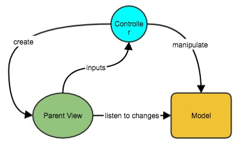
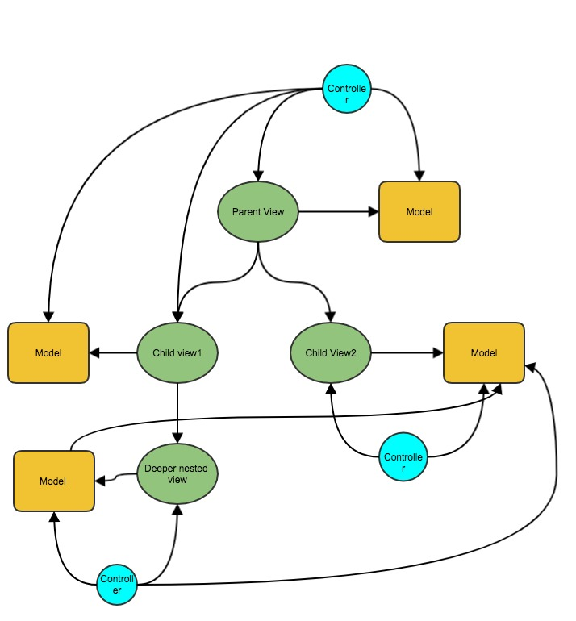
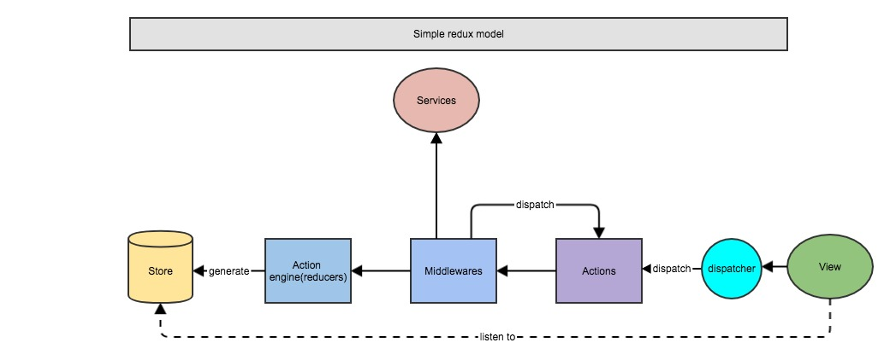
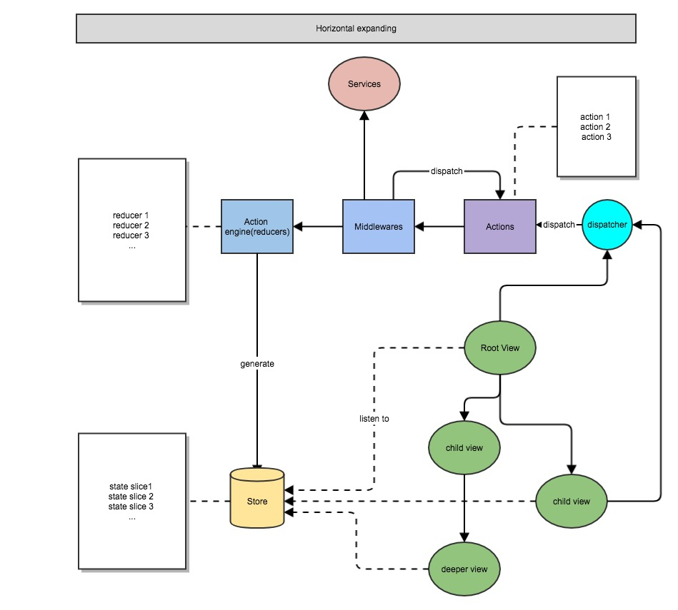

autoscale: true
build-lists: true

# Why Redux?

---

# User interface programming concerns

* Communicate with backend services
* Render views
* Respond for user actions
* Business logics
* Data management and synchronization

---

# Age of chaos, no abstraction way - jquery

* Things are easy to break
* Hard to compose and resue
* Poor readbility
* It's a mess

---

# Separation of concerns

> Abstraction and patterns are brought to separate concerns

---

# Traditional UI programming patterns

* MVC
* MVVM
* PM

---

# How does MVC works

---

# When things become complicate

* Poor for multi layer data synchronization
* Poor for complicate interactions across views
* The more views on the same page, the more complicate the relationship is, which make the systam hard to reason about.

---

# Redux come to the rescue

> Single direction data flow, declarative way to describe the system behaviors.

* Business logics are present by pure **Reducer** functions and driven by **Actions**
* **Actions** are dispatched by **Views** through a central **Dispatcher**
* Single point of truth - central data management by **Store**
* Separate the side effects into **middlewares**
* Boost Presentation/Container View patterns by **state injection**
* Shine functional programming
* It results in a very flexiable and strong, well structured, easy to expand, stable for changes system, especially for complicate UIs which have complicate interactions.

---

---

---

# Important tips to using Redux

* Carefully design the actions 
  - They presents what the behavior the system could have
  - Design actions by abstraction and semantic, don't use imperative actions.
* Carefully design the store structure

---

# No silver bullet, everything has a trade off

> When you get something, you must have to pay something in return.

* Complicate abstraction and boilerplate.

---

# Then, how do we choose?

* Modern frontend apps are always complicate, redux is excellent for them.
* The only judgement to whether adopt one thing or not is the gain bigger than the paid, it depends on different situations, it relys on your experience.
