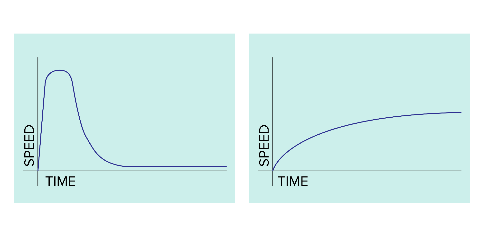

autoscale: true
build-lists: true
theme: Plain Jane, 1

# TDD Workshop updates

---

# > 40 devs attended

---

# Feedbacks

* Most of them found it's interesting and learned something, a few still have questions.

---

# Typical questions

---

# Difference between coding first?

* Different perspective, User first.
* Big picture first, details later(with shield).
* Don't need to write UT for UT(coverage).

---

# TDD => better UT, better documentation, better code

---

# Will it speed up development?

---

* Always be fast => clean code => refactor for changes => confidence => tests => TDD

---

# How to get start?

* a lot of practice
* pair programming
* weekly workshop

---

# Hope we can build up better engineer culture.
